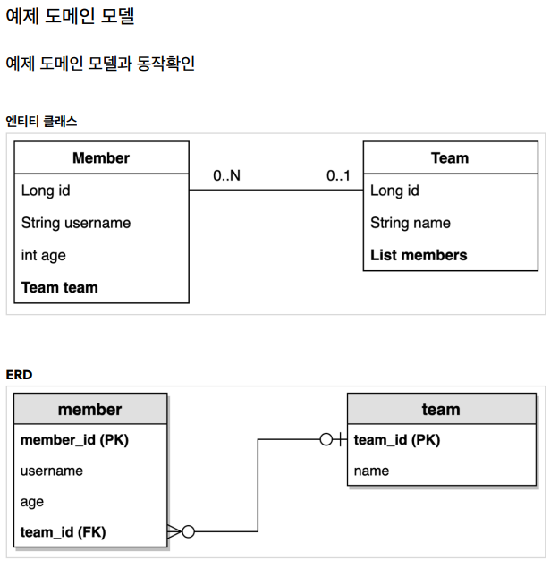
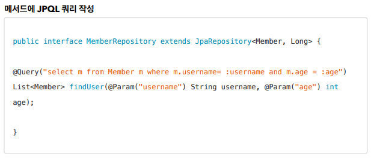

예제 도메인 모델
------------
- 

공통 인터페이스 기능
------------
- JAVA Proxy 기술로 JPA Repository 구현체를 주입함.

쿼리 메소드 기능
------------
- 메소드 이름으로 쿼리 생성
- NamedQuery
- @Query - 리파지토리 메소드에 쿼리 정의
- 파라미터 바인딩
- 반환 타입
- 페이징과 정렬
- 벌크성 수정 쿼리
- @EntityGraph

JPA Named Query
----------
- 정적 쿼리라서 Application 로딩 시점에 타입 에러를 알 수 있음. 
- 나머지 이점은 별로..(뭔가 어색한 사용법)

@Query, 리포지토리 메소드에 쿼리 정의하기
----------
- 
- 실행할 메서드에 정적 쿼리를 직접 작성하므로 이름 없는 Named 쿼리라 할 수 있음

특정값 혹은 DTO로 조회하기
-------------

파라미터 바인딩
-------------
- 위치 기반
  - 위치 기반을 쓰는게 좋다.
- 이름 기반
  - 쓰지말자.
- 컬렉션 바인딩
  - 실무에서 빈번히 사용 된다.

순수 JPA 페이징과 정렬
-------------

스프링 데이터 JPA 페이징과 정렬
-------------
- 오! 편하군!
- Page <-> Slice 변환도 간편!
- count 쿼리를 분리해서 JOIN이 많이 일어나는 상황에서 최적화도 가능!
- Page 인덱스 1이 아니라 0부터 시작한다!

벌크성 수정 쿼리
-------------
- @Modifying 어노테이션
- Bulk 연산은 영속성을 무시하고 동작하기 때문에 주의해서 사용해야함
  - 벌크연산 이후 em.flush() & em.clear()를 호출해서 영속성 컨텍스트를 리로드해야함!
    - JPQL 수행 전에 flush가 자동호출되므로.. flush는 생략해도 되지만.. clear는 생략할 수 없음!
  - 스프링 데이터 JPA에서는 @Modifying(clearAutomatically = true)를 활용해도 된다! 
 