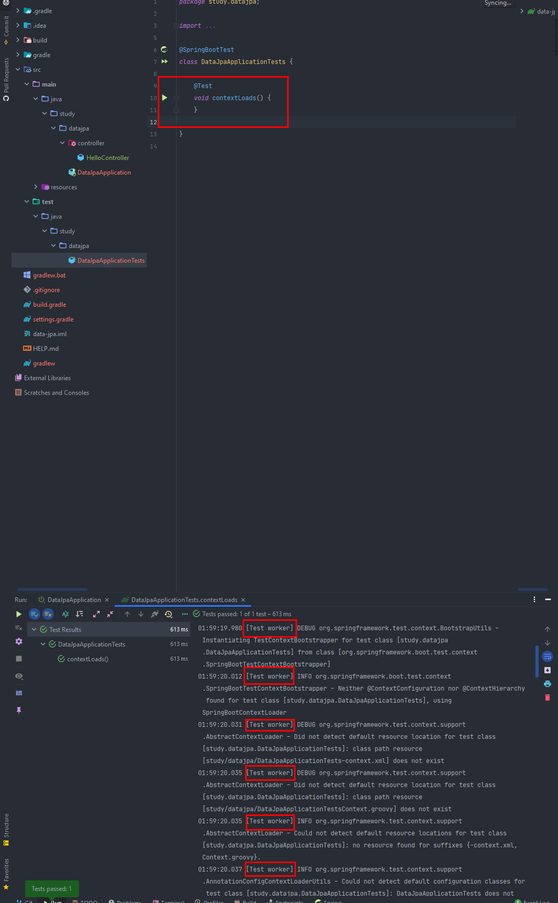
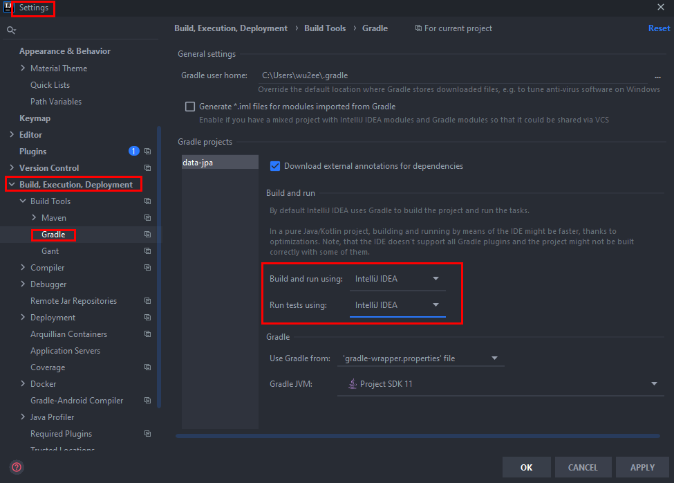
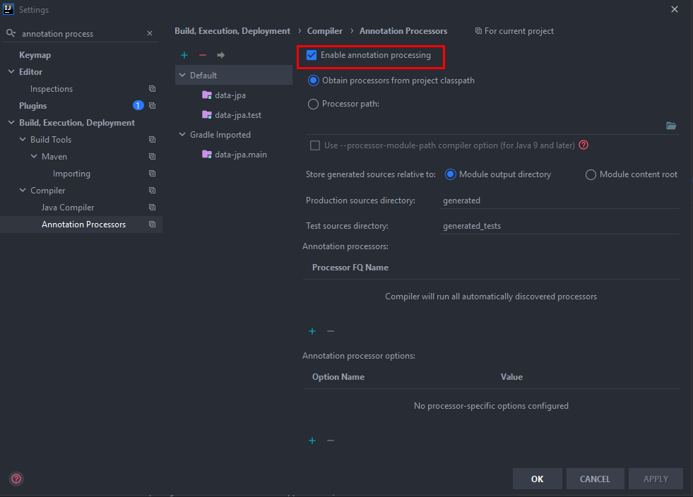

# section 1. 프로젝트 환경설정

인텔리제이 최신버전은 IDE에서 자바를 바로 띄우는게 아니라 gradle을 통해서 실행하기 때문에(이거 때문에 Test work 로그가 뜨면서 느려짐) 셋팅을 추가로 해줘야 함.

setting에서 build and run using, build tests using을 gradle ⇒ IntelliJ IDEA 로 바꿔주면 됨.

그리고 롬복 사용할 때는 Enable annotation processing 옵션을 체크해야 한다.

# 스프링 데이터 JPA와 DB 설정, 동작 확인

> 같은 트랜잭션안에서 JPA의 영속성 컨텍스트의 동일성을 생각해야 함. (1차 캐시) 다른 트랜잭션이라면 영속성 컨텍스트의 동일성이 보장되지 않음.