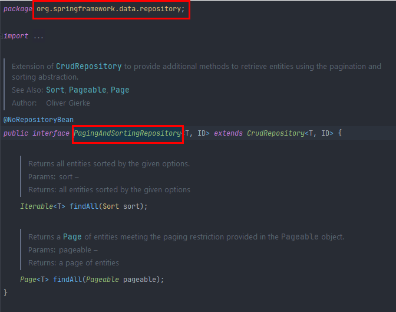

# section 3. 공통 인터페이스 기능

# 1. 순수 JPA 기반 리포지토리 만들기

# 2. 공통 인터페이스 설정

```java
public interface MemberRepository extends JpaRepository<Member, Long> {
}
```

MemberRepository  구현체가 없는데 어떻게 save, findById를 사용할 수 있었을까?

```java
@SpringBootTest
@Transactional
@Rollback(false)
class MemberRepositoryTest {

	@Autowired
	MemberRepository memberRepository;

	@Test
	public void testMember() {
		System.out.println("memberRepository = " + memberRepository.getClass());
		Member member = new Member("memberA");
		Member savedMember = memberRepository.save(member);

		Member findMember = memberRepository.findById(savedMember.getId()).get();

		assertThat(findMember.getId()).isEqualTo(member.getId());
		assertThat(findMember.getUsername()).isEqualTo(member.getUsername());
		assertThat(findMember).isEqualTo(member);
	}

}
```

테스트 코드 맨위에 @Autowired로 memberRepository를 주입하고 getClass() 메서드를 이용하여 출력해보면


프록시가 뜬다.

`스프링`이 MemberRepository 인터페이스를 보고, `스프링 데이터 JPA`가 구현 클래스를 만들어서 주입시켜 준다. (`스프링 데이터 JPA`가 자바의 기본적인 **프록시** 기술을 이용하여 가짜 클래스를 만들어 준 다음 주입시킴)

⇒ `@Repository` 애노테이션 생략 가능하다.

JpaRepository 인터페이스만 잘 implements 해주면 

1. 컴포넌트 스캔을 `스프링 데이터 JPA`가 자동으로 처리해 준다.
2. `JPA 예외`를 `스프링 예외`로 변환하는 과정도 자동으로 처리해 준다.

# 3. 공통 인터페이스 적용


JpaRepository 인터페이스는 org.springframework.data.jpa.repository 패키지에 있음.

(보통 몽고 db, redis 같은 것들이 스프링에서는 org.springframework.data.mongo~, org.springframework.data.redis~ 패키지에 있음)



근데 PagingAndSortingRepository 인터페이스는 org.springframework.data.repository 패키지에 있음. (jpa 패키지가 아님)

즉, 페이징은 jpa나 mongo나 redis나 크게 달라지는 형태가 아니므로 data.repository 패키지에 있다는 뜻으로 볼 수 있음.


다음과 같이 공통인 패키지에 PagingAndSortingRepository 인터페이스가 있고, (다른 db를 쓰더라도 공통적으로 이 패키지에 있는 것들을 이용함)


data-jpa 패키지에 JpaRepository 인터페이스가 있음을 확인할 수 있음.


**JpaRepository 인터페이스는 JPA에 특화된 기능을 제공함.** 나머지 ****PagingAndSortingRepository, CrudRepository, Repository 인터페이스는 스프링에서도 사용할 수 있는 내용들임. (JPA에서 몽고db로 바꾸더라도 이런 기능들을 거의 유사하게 제공해주는 장점이 있음)

### 주의

`T findOne(ID)` ⇒ `Optional<T> findById(ID)` 로 변경됨. (최신 스프링 데이터 JPA에 반영 되어 있음)

### 제네릭 타입

- `T` : 엔티티
- `ID` : 엔티티의 식별자 타입
- `S` : 엔티티와 그 자식 타입

### 주요 메서드

`**save(S)**` : 새로운 엔티티는 저장하고 이미 있는 엔티티는 병합한다.
`**delete(T)**` : 엔티티 하나를 삭제한다. 내부에서 `EntityManager.remove()` 호출
`**findById(ID)**` : 엔티티 하나를 조회한다. 내부에서 `EntityManager.find()` 호출
`**getOne(ID)**` : 엔티티를 프록시로 조회한다. 내부에서 `EntityManager.getReference()` 호출
`**findAll(…)`** : 모든 엔티티를 조회한다. 정렬(**Sort**)이나 페이징(**Pageable**) 조건을 파라미터로 제공할 수
있다.

> 참고: JpaRepository 는 **대부분의 공통 메서드**를 제공한다.
>
