# 4. 쿼리 메소드 기능

## - **메소드 이름으로 쿼리 생성**

```java
public interface MemberRepository extends JpaRepository<Member, Long> {
	List<Member> findByUsername(String username);
}
```

인터페이스에 findByUsername 메소드를 정의했을 뿐인데 어떻게 username으로 찾을 수 있을까?

spring data jpa는 `쿼리 메소드`를 제공함.

### 쿼리 메소드의 기능 3가지

1. 메소드 이름으로 쿼리 생성함.
2. 메소드 이름으로 JPA NamedQuery 호출함.
3. `@Query` 어노테이션을 사용해서 리포지토리 인터페이스에 쿼리 직접 정의 가능

예를들어 이름과 나이를 기준으로 회원을 조회하려면?

```java
@Repository
public class MemberJpaRepository {

	...

	public List<Member> findByUsernameAndAgeGreaterThan(String username, int age) {
		return em.createQuery("select m from Member m where m.username = :username and m.age > :age")
			.setParameter("username", username)
			.setParameter("age", age)
			.getResultList();
	}

}
```

이렇게 custom한 JPA 쿼리를 짜고 싶을때 스프링 데이터 JPA는

```java
public interface MemberRepository extends JpaRepository<Member, Long> {
	List<Member> findByUsernameAndAgeGreaterThan(String username, int age);
}
```

이렇게 메소드 이름만 잘 지정해두면 JPA와 똑같이 작동한다. 

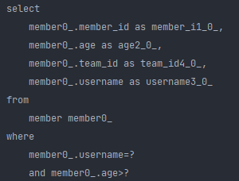

`findByUsernameAndAgeGreaterThan` ← 스프링 데이터 JPA가 쿼리 메소드이름을 분석하여 위와 같은 쿼리를  만들어 줌.

> 참고 : 쿼리 메소드에 And 조건이 2개이상 들어갈 때는 쿼리 메소드 이름이 너무 길어지므로 이때는 jpql과 같이 다른 방식으로 풀어내는게 좋다.
>

### 쿼리 메소드 필터 조건

스프링 데이터 JPA 공식 문서 참고 : [https://docs.spring.io/spring-data/jpa/docs/current/reference/html/#jpa.query-methods.query-creation](https://docs.spring.io/spring-data/jpa/docs/current/reference/html/#jpa.query-methods.query-creation)

### 스프링 데이터 JPA가 제공하는 쿼리 메소드 기능

- 조회 : find…By ,read…By ,query…By get…By, ~
    - [https://docs.spring.io/spring-data/jpa/docs/current/reference/html/#repositories.query-methods.query-creation](https://docs.spring.io/spring-data/jpa/docs/current/reference/html/#repositories.query-methods.query-creation)
    - 예시 : findHelloBy 처럼 ...에 식별하기 위한 내용(설명)이 들어가도 된다.

...에는 아무거나 들어가도 되고(설명을 위한 내용 넣으면 좋다), By 뒤에 아무것도 없으면 where 절 조건이 없다고 취급하고 전부다 가져옴. 

- COUNT : count…By 반환타입 `long`
- EXISTS : exists…By 반환타입 `boolean`
- 삭제 : delete…By, remove…By 반환타입 `long`
- DISTINCT : findDistinct, findMemberDistinctBy
- LIMIT : findFirst3, findFirst, findTop, findTop3
    - [https://docs.spring.io/spring-data/jpa/docs/current/reference/html/#repositories.limit-query-result](https://docs.spring.io/spring-data/jpa/docs/current/reference/html/#repositories.limit-query-result)
    

```java
@Test
public void findHelloBy() {
	List<Member> helloBy = memberRepository.findTop3HelloBy();
}
```

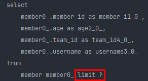

이렇게 findTop 쿼리 메소드도 실제 쿼리에서 limit 이 잘 붙어서 나온다.

> 참고 : 이 기능은 엔티티의 필드명이 변경되면 인터페이스에 정의한 메서드 이름도 꼭 함께 변경해야 한다. 이렇게 애플리케이션 로딩 시점에 오류를 인지할 수 있는 것이 스프링 데이터 JPA의 매우 큰 장점이다.
>

## - NamedQuery

이 기능은 실무에서 쓸 일이 거의 없다.

```java
@NamedQuery(
	name="Member.findByUsername",
	query="select m from Member m where m.username = :username"
)
public class Member {
```

엔티티 클래스 위에 @NamedQuery 를 붙여 주고 jpql을 짠다.

```java
@Repository
public class MemberJpaRepository {

	...

	public List<Member> findByUsername(String ussername) {
		return em.createNamedQuery("Member.findByUsername", Member.class)
			.setParameter("username", "회원1")
			.getResultList();
	}
}
```

그리고 findByUsername에서 createNamedQuery라는 메소드를 이용해서 사용할 수 있다.

근데 이렇게 하나씩 구현하는게 너무 귀찮다. 이걸 스프링 데이터 JPA가 해결해 준다.

```java
public interface MemberRepository extends JpaRepository<Member, Long> {

	...

	@Query(name = "Member.findByUsername")
	List<Member> findByUsername(@Param("username") String username);
}
```

이렇게 인터페이스에 메소드를 정의하고, @Query 애노테이션에 엔티티에서 정의해 뒀던 namedQuery의 이름을 지정해두고, jpql에서 받는 username을 @Param 애노테이션으로 해서 매핑해주면 이 메소드를 사용할 수 있다.

```java
public interface MemberRepository extends JpaRepository<Member, Long> {

	...

	//@Query(name = "Member.findByUsername")
	List<Member> findByUsername(@Param("username") String username);
}
```

@Query 어노테이션이 없어도 동작하는데, 스프링 데이터 JPA 동작 관례가 JpaRepository의 도메인 클래스(Member)에 .(점)과 메서드 이름을 붙여서 엔티티에 정의된 namedQuery를 먼저 찾는게 관례이다. 그래서 @Query 어노테이션 없이 동작이 가능했음. ⇒ 만약 namedQuery가 없다면 쿼리메소드로 만들어 준다.

<aside>
💡 이 `namedQuery` 방법은 실무에서 거의 안씀. 엔티티 위에 jpql을 작성해야 하는것도 불편하고, (물론 따로 빼는 방법이 존재하긴 함) ⇒ 대신 `@Query`를 사용해서 리포지토리의 메소드 위에 바로 쿼리를 지정할 수있는 방법이 있기 때문에 이 `namedQuery`는 실무에서 사용하지 않는다.

그럼에도 NamedQuery가 가지는 가장 큰 장점이 있다.

```java
public List<Member> findByUsernameAndAgeGreaterThan(String username, int age) {
		return em.createQuery("select m from Member m where m.usern12312asdfame = :username and m.age > :age")
			.setParameter("username", username)
			.setParameter("age", age)
			.getResultList();
	}
```

그냥 JPA를 사용했다면 m.username에 위와같이 오타를 넣었을때, string 이기 때문에 에러를 내지 않고 애플리케이션이 로딩된다. 그래서 결국 유저가 클릭했을때 에러가 발생하게 된다.

```java
@NamedQuery(
	name="Member.findByUsername",
	query="select m from Member m where m.userasdasname = :username"
)
public class Member {
```

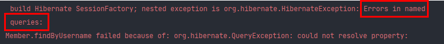

이렇게 namedQuery에서는 애플리케이션 로딩 시점에 위 query를 한번 파싱해서 오류가 있으면 문법 오류를 알려준다.

이게 namedQuery의 가장 큰 장점이다.

## - @Query, 리포지토리 메소드에 쿼리 정의하기

```java
public interface MemberRepository extends JpaRepository<Member, Long> {

	...

	@Query("select m from Member m where m.username = :username and m.age = :age")
	List<Member> findUser(@Param("username") String username, @Param("age") int age);
}
```

이렇게 메소드 위에 바로 @Query 애노테이션으로 jqpl을 이용할 수 있다. (쿼리 메소드 대용으로 사용 가능)

```java
public interface MemberRepository extends JpaRepository<Member, Long> {

	...

	@Query("select m from Member m where m.useasdrname = :username and m.age = :age")
	List<Member> findUser(@Param("username") String username, @Param("age") int age);
}
```

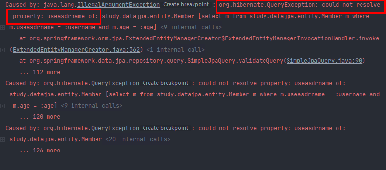

이렇게 했을 때 장점은 namedQuery와 같이 jpql에 오타가 있을 때 애플리케이션 로딩 시점에서 에러를 잡아준다.

**@Query는 이름이 없는 naemdQuery라고 보면 된다.**

## - @Query, 값, DTO 조회하기

지금까지는 엔티티 타입만 조회해 왔는데, 단순한 값이나 DTO 조회를 할 수도 있다.

```java
public interface MemberRepository extends JpaRepository<Member, Long> {

	...
	@Query("select m.username from Member m")
	List<String> findUsernameList();
}
```

이렇게 username만 리스트로 가져올 수 있다.

> 참고 : JPA 값 타입(`@Embedded`)도 이 방식으로 조회할 수 있음.
>

Dto를 가져오려면

```java
@Data
public class MemberDto {

	private Long id;
	private String username;
	private String teamName;

	public MemberDto(Long id, String username, String teamName) {
		this.id = id;
		this.username = username;
		this.teamName = teamName;
	}
}
```

Dto 클래스를 먼저 만들고

```java
@Query("select new study.datajpa.dto.MemberDto(m.id, m.username, t.name) from Member m join m.team t")
List<MemberDto> findMemberDto();
```

DTO 조회를 위한 Query를 짜면 된다. (JPA의 new 명령어를 사용해야함.)

## - 파라미터 바인딩

- 위치 기반 (거의 사용하지 않음)
- 이름 기반

```sql
select m from Member m where m.username = ?0 //위치 기반
select m from Member m where m.username = :name //이름 기반
```

> 참고 : 코드 가독성과 유지보수를 위해 이름 기반 파라미터 바인딩을 사용하자.
>

### 컬렉션 파라미터 바인딩

`Collection` 타입으로 in 절을 지원함.

```java
@Query("select m from Member m where m.username in :names")
List<Member> findByNames(@Param("names") Collection<String> names);
```

(이때 names에 null이 들어가도 error 터지지 않음)

## - 반환 타입

스프링 데이터 JPA는 유연한 반환 타입을 지원한다.

```java
List<Member> findByUsername(String name); //컬렉션
Member findByUsername(String name); //단건
Optional<Member> findByUsername(String name); //단건 Optional
```

스프링 데이터 JPA 공식 문서 : [https://docs.spring.io/spring-data/jpa/docs/current/reference/html/#repository-query-return-types](https://docs.spring.io/spring-data/jpa/docs/current/reference/html/#repository-query-return-types)

List 반환 타입은 null이 반환되지 않음. (찾으려는 값이 없으면 empty를 리턴함)

```java
@Test
public void returnType() {
	Member m1 = new Member("AAA", 10);
	Member m2 = new Member("BBB", 20);
	memberRepository.save(m1);
	memberRepository.save(m2);

	List<Member> result = memberRepository.findListByUsername("asdfadsf");
	System.out.println("result = " + result.size());
}
```


findListByUsername 결과로 빈값이 result로 담겨서 size가 0이 찍힌다.

```java
@Test
public void returnType() {
	Member m1 = new Member("AAA", 10);
	Member m2 = new Member("BBB", 20);
	memberRepository.save(m1);
	memberRepository.save(m2);

	Member findMember = memberRepository.findMemberByUsername("asdfadsf");
	System.out.println("result = " + findMember);
}
```

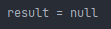

근데 단건 조회는 없으면 null이 반환된다.

 JPA 는 하나를 조회해서 없으면 NoResultException이 뜬다. 근데 spring data jpa는 얘를 try catch해서 null로 반환해 줌.

실무입장에서는 null로 날아오는게 낫다. 이건 자바 8 이전의 논쟁이고, 자바 8부터는 Optional이 지원되면서 Optional로 null처리를 해줌.

```java
@Test
public void returnType() {
	Member m1 = new Member("AAA", 10);
	Member m2 = new Member("BBB", 20);
	memberRepository.save(m1);
	memberRepository.save(m2);

	Optional<Member> findMember = memberRepository.findOptionalByUsername("asdfadsf");
	System.out.println("result = " + findMember);
}
```

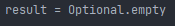

이렇게 empty라고 뜬다. 

결론 : db에서 데이터를 조회하는데, 값이 있을 수도 있고 없을 수도 있다면 Optional 쓰는게 맞다. 

```java
@Test
public void returnType() {
	Member m1 = new Member("AAA", 10);
	Member m2 = new Member("AAA", 20);
	memberRepository.save(m1);
	memberRepository.save(m2);

	Optional<Member> findMember = memberRepository.findOptionalByUsername("AAA");
	System.out.println("result = " + findMember);
}
```

만약 단건 조회인데 List 결과가 나오는 상황이라면 exception이 터진다.

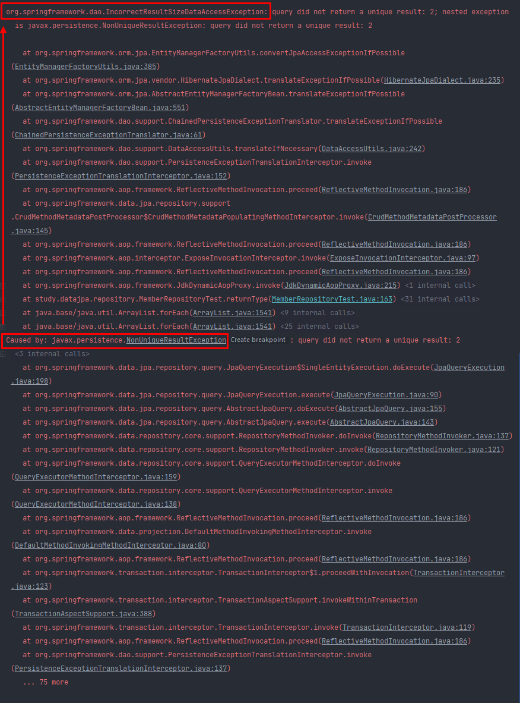

원래는 JPA에서 `NonUniqueResultException`이 터지는데, 그러면 스프링 데이터 JPA가 `IncorrectResultSizeDataAccessException`(스프링 프레임워크 exception)으로 바꿔서 익셉션을 던져준다.

왜냐면 repository기술은 JPA가 될 수도 있고, 몽고DB가 될수도있고 다른 기술이 될 수도 있는데, 이걸 사용할 여러 클라이언트 코드는 NonUniqueResultException과 같은 JPA Exception에 의존하는게 아니라 스프링이 추상화하는 예외처리로 감싸주면 하위 코드로 JPA든 몽고 DB든 클라이언트 코드를 바꿀 필요 없이 스프링이 예외를 한번 감싸서 공통 예외사항으로 던져준다.

# - 순수 JPA 페이징과 정렬

```java
public List<Member> findByPage(int age, int offset, int limit) {
	return em.createQuery("select m from Member m where m.age = :age order by m.username desc")
		.setParameter("age", age)
		.setFirstResult(offset)
		.setMaxResults(limit)
		.getResultList();
}

public long totalCount(int age) {
	return em.createQuery("select count(m) from Member m where m.age = :age", Long.class)
		.setParameter("age", age)
		.getSingleResult();
} // 페이징할때 몇번째 페이지인지를 나타내기 위해 필요한 count를 세는 쿼리를 만든다.
```

```java
@Test
public void paging() {
    //given
	memberJpaRepository.save(new Member("member1", 10));
	memberJpaRepository.save(new Member("member2", 10));
	memberJpaRepository.save(new Member("member3", 10));
	memberJpaRepository.save(new Member("member4", 10));
	memberJpaRepository.save(new Member("member5", 10));

	int age = 10;
	int offset = 0;
	int limit = 3;

    //when
	List<Member> members = memberJpaRepository.findByPage(age, offset, limit);
	long totalCount = memberJpaRepository.totalCount(age);

	// 페이지 계산 공식 적용 ...
	// totalPage = totalCount / size ...
	// 마지막 페이지 ...
	// 최초 페이지 ...
	// 이 공식은 spring data jpa에서 제공해주는 것을 이용한다. (지금은 jpa 이므로 생략)

	//then
	assertThat(members.size()).isEqualTo(3);
	assertThat(totalCount).isEqualTo(5);
}
```

JPA의 경우에는 이렇게 페이징 쿼리를 작성하고 테스트를 작성하면 (offset[페이지 번호]과 limit[페이지당 보여줄 데이터 갯수]을 이용하여 페이지당 얼마를 가져올지 계산해 줄 수 있다)

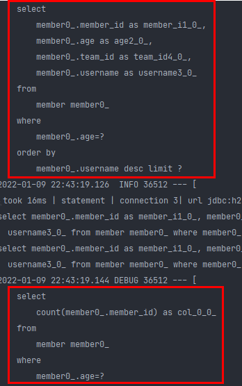

위와 같이 페이지당 멤버와, total 갯수 쿼리를 가져오는 것을 확인할 수 있다.

## - 스프링 데이터 JPA 페이징과 정렬

**페이징과 정렬 파라미터**

- `org.springframework.data.domain.Sort` : 정렬 기능
- `org.springframework.data.domain.Pageable` : 페이징 기능 (내부에 Sort 포함)

JPA에 종속적이지 않고 스프링 프레임워크가 위 두개의 인터페이스로 페이징을 통일하여 지원해 줌.

**특별한 반환 타입**

- `org.springframework.data.domain.Page` : 추가 count 쿼리 결과를 포함하는 페이징
- `org.springframework.data.domain.Slice` : 추가 count 쿼리 없이 다음 페이지만 확인 가능 (내부적으로 limit + 1조회) ⇒ 페이지 번호 없이 **더보기** 처럼 페이지를 불러올 때 사용
- List (자바 컬렉션): 추가 count 쿼리 없이 결과만 반환

페이징과 정렬 사용 예제

```java
Page<Member> findByUsername(String name, Pageable pageable); //count 쿼리 사용
Slice<Member> findByUsername(String name, Pageable pageable); //count 쿼리 사용
안함
List<Member> findByUsername(String name, Pageable pageable); //count 쿼리 사용
안함
List<Member> findByUsername(String name, Sort sort);
```

두 번째 파라미터로 받은 `Pagable`은 인터페이스다. 따라서 실제 사용할 때는 해당 인터페이스를 구현한 `org.springframework.data.domain.PageRequest` 객체를 사용한다.

예를들어 age로 페이징 처리를 하고 싶다면

```java
public interface MemberRepository extends JpaRepository<Member, Long> {

	...

	Page<Member> findByAge(int age, Pageable pageable);
}
```

인터페이스에 Pageable을 인자로 받는 메소드를 정의하고,

```java
@Test
public void paging() {
	//given
	memberRepository.save(new Member("member1", 10));
	memberRepository.save(new Member("member2", 10));
	memberRepository.save(new Member("member3", 10));
	memberRepository.save(new Member("member4", 10));
	memberRepository.save(new Member("member5", 10));

	int age = 10;
	PageRequest pageRequest = PageRequest.of(0, 3, Sort.by(Sort.Direction.DESC, "username"));

	//when
	Page<Member> page = memberRepository.findByAge(age, pageRequest);

	//then
	List<Member> content = page.getContent(); // 페이지에서 데이터 가져오고 싶을때 getContent() 메서드 이용 (조회된 데이터)
	long totalElements = page.getTotalElements();

	for (Member member : content) {
		System.out.println("member = " + member);
	}
	System.out.println("totalElements = " + totalElements);

	assertThat(content.size()).isEqualTo(3); // 조회된 데이터 수
	assertThat(page.getTotalElements()).isEqualTo(5); // 전체 데이터 수
	assertThat(page.getNumber()).isEqualTo(0); // 페이지 번호
	assertThat(page.getTotalPages()).isEqualTo(2); // 전체 페이지 번호
	assertThat(page.isFirst()).isTrue(); // 첫번째 항목인가?
	assertThat(page.hasNext()).isTrue(); // 다음 페이지가 있는가?
}
```

테스트 코드에서 실제로 Pageable을 넘겨줄때 그 구현체인 PageRequest를 넘겨주면 된다.

`PageRequest` 생성자의 첫 번째 파라미터에는 현재 페이지를, 두 번째 파라미터에는 조회할 데이터 수를 입력한다. 여기에 추가로 정렬 정보도 파라미터로 사용할 수 있다. 참고로 페이지는 0부터 시작한다.

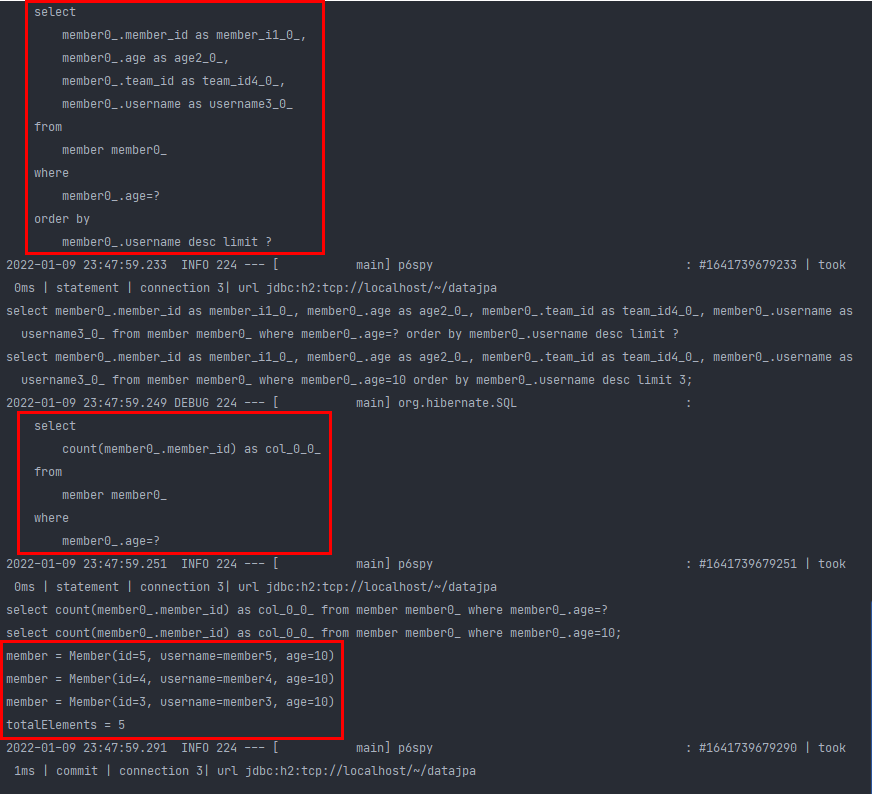

인터페이스의 메소드만 정의했을 뿐인데, **페이징 쿼리**와 **totalCount쿼리**가 알아서 나눠서 나가는 것을 확인할 수 있다.

**Slice를 사용한 예제**

```java
public interface MemberRepository extends JpaRepository<Member, Long> {

	...

	Slice<Member> findByAge(int age, Pageable pageable);
}
```

```java
@Test
public void paging_slice() {
	//given
	memberRepository.save(new Member("member1", 10));
	memberRepository.save(new Member("member2", 10));
	memberRepository.save(new Member("member3", 10));
	memberRepository.save(new Member("member4", 10));
	memberRepository.save(new Member("member5", 10));

	int age = 10;
	PageRequest pageRequest = PageRequest.of(0, 3, Sort.by(Sort.Direction.DESC, "username"));

	//when
	Slice<Member> page = memberRepository.findByAge(age, pageRequest);

	//then
	List<Member> content = page.getContent();
	
	assertThat(content.size()).isEqualTo(3);
	assertThat(page.getNumber()).isEqualTo(0);
	assertThat(page.isFirst()).isTrue();
	assertThat(page.hasNext()).isTrue();
}
```

slice는 total 갯수와 total 페이지를 모르므로 비교할 수 없기 때문에 assert 비교에서 제거함.

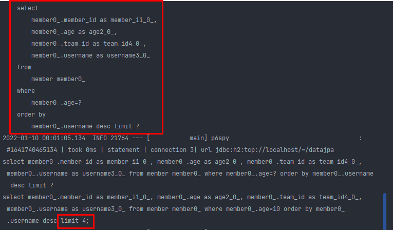

limit가 4가 나오는데, 우리가 요청한 3보다 하나를 더 요청해 온다.

(모바일 디바이스에서 많이 씀)

totalCount와 같은 쿼리는 반환 타입에 의해 결정됨. 그래서 

```java
public interface MemberRepository extends JpaRepository<Member, Long> {

	...

	List<Member> findByAge(int age, Pageable pageable);
}
```

단순히 페이지에 대한 Member 객체 데이터만 필요하면 그냥 List 반환타입으로 정의해서 가져오면 됨. 

**실무에서 중요한 얘기**

사실 total 카운트는 db의 모든 데이터를 카운팅 해야 한다. 그래서 보통 total count 자체가 성능이 느리다. (페이징이야 데이터를 짤라오기 때문에 성능 최적화가 되는데, 데이터가 많을 수록 total count는 성능이 느림)

그래서 이 total count 쿼리를 잘 짜야 함.

예를들어 멤버와 그 팀을 쿼리해 온다고 하면, 실제로 멤버에 left outer join으로 팀을 같이 가져와서 짜는데, 사실 total count 쿼리는 굳이 join을 할 필요가 없다. 그래서 얘를 분리해서 쿼리를 짤 수 있음.

```java
@Query(value = "select m from Member m left join m.team t")
Page<Member> findByAge(int age, Pageable pageable);
```

만약 카운트 쿼리를 분리하지 않고 그냥 이렇게 짰다면

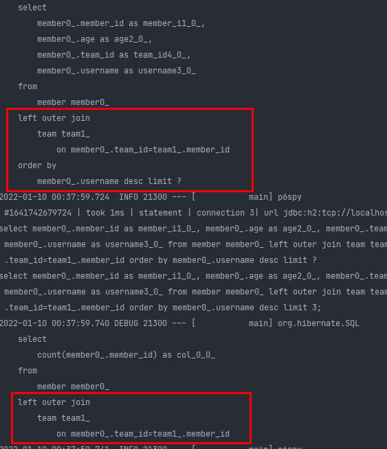

원래 페이징 쿼리도 join을 하고, total count 쿼리도 join을 한다. (total count 쿼리는 join 할 필요 가 없는데..) ⇒ 성능 저하의 원인 (**전체 count 쿼리는 매우 무겁다!**)

```java
@Query(value = "select m from Member m left join m.team t",
			countQuery = "select count(m.username) from Member m")
Page<Member> findByAge(int age, Pageable pageable);
```

그래서 이렇게 카운트 쿼리를 분리하여 작성하면

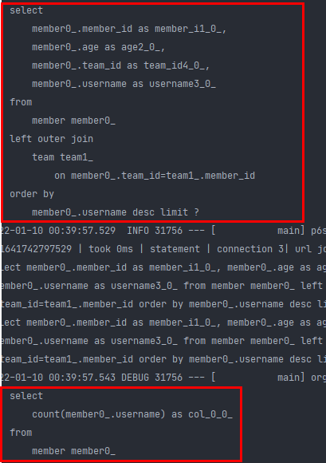

페이징 쿼리는 복잡해도 카운트 쿼리는 심플하게 나간다. join이 없기 때문에 데이터가 아무리 많아도 데이터베이스에서 쉽게 가져올 수 있다.

```java
@Query(value = "select m from Member m") // 비즈니스 로직 쿼리만 집중
Page<Member> findByAge(int age, Pageable pageable); // 페이징 쿼리는 스프링이 알아서!
```

결론적으로 스프링 데이터 JPA에서는 Page와 Pageable에 의해 페이징과 관련된 토탈 카운트 쿼리등을 날려주고, 개발자는 핵심 비즈니스 로직에 대한 쿼리에 대한 고민만 하면 된다.

> 참고 : sorting정보가 너무 복잡하면 PageRequest에다가 Sort.by() 이렇게 처리가 안된다. 그때는 그냥 jpql로 처리하면 됨.
>

Page의 map 메소드를 이용하면 엔티티를 dto로 쉽게 변환 가능

```java
Page<Member> page = memberRepository.findByAge(age, pageRequest);
Page<MemberDto> toMap = page.map(member -> new MemberDto(member.getId(), member.getUsername(), null));
```

이렇게 map을 이용하여 Dto로 변환하여 API로 뿌려주면 된다.

## - 벌크성 수정 쿼리

dirty check의 경우 데이터 한건씩 처리하는 경우 였다.

근데 만약 전 직원의 연봉을 10% 인상하라는 경우가 생긴다면? 이때는 전부다 끌어와서 update 쿼리를 날리는게 낫다. (쿼리 1번으로 쫙 udpate 함 ⇒ JPA에서 `벌크성 쿼리`라고 함.)

```java
@Repository
public class MemberJpaRepository {

	...

	public int bulkAgePlus(int age) {
		return em.createQuery(
			"update Member m set m.age = m.age + 1" +
				" where m.age >= :age")
			.setParameter("age", age)
			.executeUpdate();
	}
}
```

순수한 JPA에서는 executeUpdate를 치면 됨.

```java
public interface MemberRepository extends JpaRepository<Member, Long> {

	...
	@Modifying
	@Query("update Member m set m.age = m.age + 1 where m.age >= :age")
	int bulkAgePlus(@Param("age") int age);
}
```

스프링 데이터 JPA에서는 `@Query`로 똑같이 쿼리를 짜고, `@Modifying` 애노테이션을 붙여줘야 한다. (그래야 executeUpdate를 쳐주고, 만약 없으면 single 또는 list result를 반환함)

JPA에서 이 벌크성 쿼리를 조심해야 함. JPA는 영속성 컨텍스트에서 엔티티가 관리가 되는데, 벌크 연산은 그걸 무시하고 바로 db에 다 커밋을 해버린다.

```java
@Test
public void bulkUpdate() {
	// given
	memberRepository.save(new Member("member1", 10));
	memberRepository.save(new Member("member2", 19));
	memberRepository.save(new Member("member3", 20));
	memberRepository.save(new Member("member4", 21));
	memberRepository.save(new Member("member5", 40));

	// when
	int resultCount = memberRepository.bulkAgePlus(20);

	List<Member> result = memberRepository.findByUsername("member5");
	Member member5 = result.get(0);
	System.out.println("member5 = " + member5);

	// then
	assertThat(resultCount).isEqualTo(3);
}
```

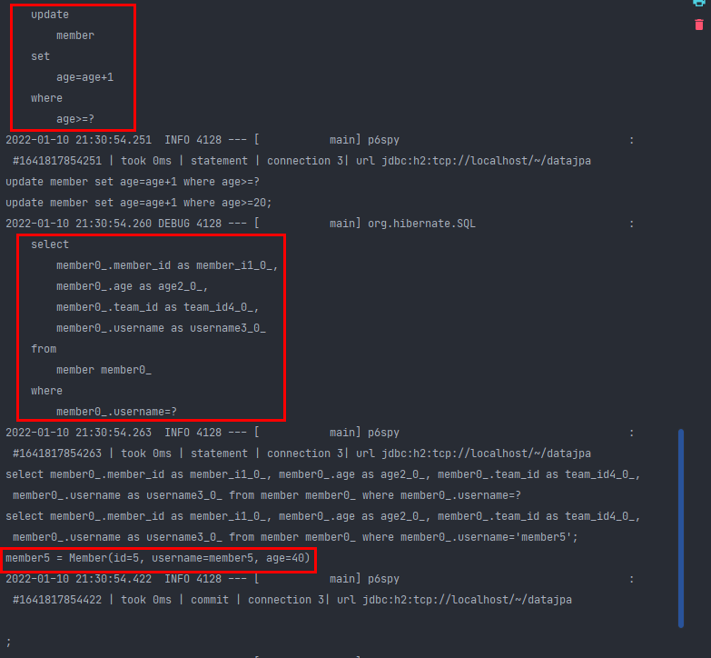

member5를 벌크성 수정 쿼리로 41살로 db에 update 친 뒤, 조회를 했는데 41이 아닌 40이 조회된다.

벌크성 쿼리가 영속성 컨텍스트를 무시하고 바로 db에만 업데이트 했기 때문에 영속성 컨텍스트에 남아있는 member5는 아직 40이기 때문임.

```java
@SpringBootTest
@Transactional
@Rollback(false)
class MemberRepositoryTest {

	...

	@PersistenceContext
	EntityManager em;

	@Test
	public void bulkUpdate() {
		// given
		memberRepository.save(new Member("member1", 10));
		memberRepository.save(new Member("member2", 19));
		memberRepository.save(new Member("member3", 20));
		memberRepository.save(new Member("member4", 21));
		memberRepository.save(new Member("member5", 40));

		// when
		int resultCount = memberRepository.bulkAgePlus(20);
		em.flush();
		em.clear();

		List<Member> result = memberRepository.findByUsername("member5");
		Member member5 = result.get(0);
		System.out.println("member5 = " + member5);

		// then
		assertThat(resultCount).isEqualTo(3);
	}
}
```

그래서 벌크성 쿼리를 날린 뒤에는 **영속성 컨텍스트를 다 날려버려야 한다.**

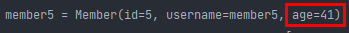

그러면 영속성 컨텍스트가 아닌 db에서 조회해 오기 때문에 벌크 업데이트가 적용된 41이 조회된다.

> 참고 : jpql을 적으면, 그 전까지는 영속성 컨텍스트에 남아있는 데이터들을 db에 flush하고 jpql 쿼리가 실행된다. (flush 한다고 영속성 컨텍스트 초기화 되는게 아님 → 초기화 되는건 close임. clear는 준영속 상태로 전환)
>

스프링 데이터 JPA에서는

```java
@Modifying(clearAutomatically = true)
@Query("update Member m set m.age = m.age + 1 where m.age >= :age")
int bulkAgePlus(@Param("age") int age);
```

`@Modifying(**clearAutomatically = true**)` 이렇게 자동으로 영속성 컨텍스트를 초기화 해주는 옵션을 제공해 준다.

**권장하는 방안**

- 영속성 컨텍스트에 엔티티가 없는 상태에서 벌크 연산을 먼저 실행한다.부득이하게
- 영속성 컨텍스트에 엔티티가 있으면 벌크 연산 직후 영속성 컨텍스트를 초기화 한다.

## - @EntityGraph

연관된 엔티티 들을 SQL 한번에 조회하는 방법이다. (FETCH JOIN)

```java
public interface MemberRepository extends JpaRepository<Member, Long> {

	...
	@Query("select m from Member m left join fetch m.team")
	List<Member> findMemberFetchJoin();
}
```

```java
@Test
public void findMemberLazy() {
	// given
	// member1 -> teamA
	// member2 -> teamB

	Team teamA = new Team("teamA");
	Team teamB = new Team("teamB");
	teamRepository.save(teamA);
	teamRepository.save(teamB);
	Member member1 = new Member("member1", 10, teamA);
	Member member2 = new Member("member2", 10, teamB);
	memberRepository.save(member1);
	memberRepository.save(member2);

	em.flush();
	em.clear();

	// when
	List<Member> members = memberRepository.findAll();

	for (Member member : members) {
		System.out.println("member = " + member.getUsername());
		System.out.println("member.teamClass = " + member.getTeam().getName().getClass());
		System.out.println("member.team = " + member.getTeam().getName());
	}
	
```

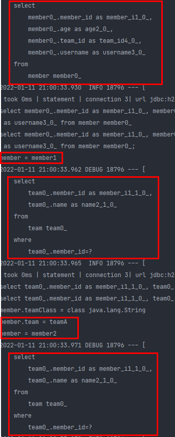

멤버와 팀 연관관계가 지연 로딩으로 설정되어 있어서 N+1 문제가 발생. (지연 로딩으로인해 select 쿼리로 조회해 온 후에야 system.out.println 실행됨)

> 참고 : 다음과 같이 지연 로딩 여부를 확인할 수 있다.
>

```java
//Hibernate 기능으로 확인
Hibernate.isInitialized(member.getTeam())
//JPA 표준 방법으로 확인
PersistenceUnitUtil util =
em.getEntityManagerFactory().getPersistenceUnitUtil();
util.isLoaded(member.getTeam());
```

그래서 아래와 같이 fetch join을 jpql로 작성함.

```java
@Query("select m from Member m left join fetch m.team")
List<Member> findMemberFetchJoin();
```

```java
@Test
public void findMemberLazy() {
	// given
	// member1 -> teamA
	// member2 -> teamB

	Team teamA = new Team("teamA");
	Team teamB = new Team("teamB");
	teamRepository.save(teamA);
	teamRepository.save(teamB);
	Member member1 = new Member("member1", 10, teamA);
	Member member2 = new Member("member2", 10, teamB);
	memberRepository.save(member1);
	memberRepository.save(member2);

	em.flush();
	em.clear();

	// when
	List<Member> members = memberRepository.findMemberFetchJoin();

	for (Member member : members) {
		System.out.println("member = " + member.getUsername());
		System.out.println("member.teamClass = " + member.getTeam().getName().getClass());
		System.out.println("member.team = " + member.getTeam().getName());
	}
}
```

findMemberFetchJoin위에 @Query로 fetch join을 하면

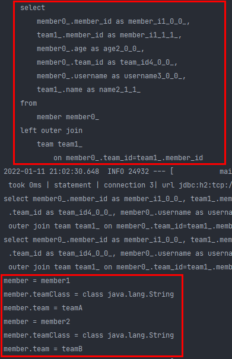

한방 쿼리로 가져온다. 

- 일반 Join : join만 하고 select 할 때 데이터를 다 가져오지 않음.
- fetch join : join과 select 할 때 데이터를 다 가져옴.

스프링 데이터 JPA에서는 fetch join을 @EntityGraph로 해결 해준다.

```java
public interface MemberRepository extends JpaRepository<Member, Long> {

	...

	@Override
	@EntityGraph(attributePaths = {"team"})
	List<Member> findAll();
}
```

findAll은 이미 JpaRepository에 정의되어 있으므로 @Override를 붙여주고, @EntityGraph에 attributePaths로 team만 정해주면 fetch join을 해준다.

```java
@Test
	public void findMemberLazy() {
		// given
		// member1 -> teamA
		// member2 -> teamB

		Team teamA = new Team("teamA");
		Team teamB = new Team("teamB");
		teamRepository.save(teamA);
		teamRepository.save(teamB);
		Member member1 = new Member("member1", 10, teamA);
		Member member2 = new Member("member2", 10, teamB);
		memberRepository.save(member1);
		memberRepository.save(member2);

		em.flush();
		em.clear();

		// when
		List<Member> members = memberRepository.findAll();

		for (Member member : members) {
			System.out.println("member = " + member.getUsername());
			System.out.println("member.teamClass = " + member.getTeam().getName().getClass());
			System.out.println("member.team = " + member.getTeam().getName());
		}
	}
```

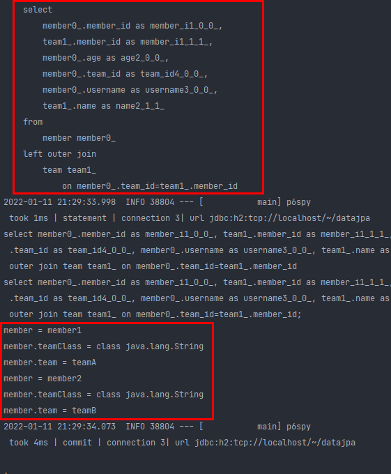

한방 쿼리로 가져온다. ⇒ **@EntityGraph는 fetch join이라고 생각하면 된다.**

(jpa 없이도 객체 그래프를 한번에 엮어서 가져올 수 있다)

```java
public interface MemberRepository extends JpaRepository<Member, Long> {

	...

	@EntityGraph(attributePaths = {"team"})
	@Query("select m from Member m")
	List<Member> findMemberEntityGraph();
}
```

이렇게 jpql을 조금 짜고 @EntityGraph 애노테이션을 써도 fetch join이 된다.

```java
@EntityGraph(attributePaths = {"team"})
List<Member> findEntityGraphByUsername(@Param("username") String username);
```

아니면 그냥 Member를 username으로 조회해오더라도 team을 fetch join으로 가져오게 할 수 있다.

```java
@Test
public void findMemberLazy() {
	// given
	// member1 -> teamA
	// member2 -> teamB

	Team teamA = new Team("teamA");
	Team teamB = new Team("teamB");
	teamRepository.save(teamA);
	teamRepository.save(teamB);
	Member member1 = new Member("member1", 10, teamA);
	Member member2 = new Member("member1", 10, teamB);
	memberRepository.save(member1);
	memberRepository.save(member2);

	em.flush();
	em.clear();

	// when
	List<Member> members = memberRepository.findEntityGraphByUsername("member1");

	for (Member member : members) {
		System.out.println("member = " + member.getUsername());
		System.out.println("member.teamClass = " + member.getTeam().getName().getClass());
		System.out.println("member.team = " + member.getTeam().getName());
	}
}
```

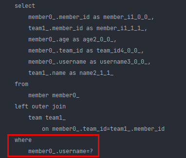

테스트 해보면 한방 쿼리로 가져오고, where절 까지 잘 적용된다.

**EntityGraph 정리**

- 사실상 페치 조인(FETCH JOIN)의 간편 버전
- LEFT OUTER JOIN을 사용한다.

사실 이 @EntityGraph는 JPA에서 제공해주는 기능이다.

이 외에도 @NamedQuery와 비슷한 @NamedEntityGraph를 제공해준다.

```java
@Entity
@Getter @Setter
@NoArgsConstructor(access = AccessLevel.PROTECTED)
@ToString(of = {"id", "username", "age"}) 
@NamedQuery(
	name="Member.findByUsername",
	query="select m from Member m where m.username = :username"
)
@NamedEntityGraph(name = "Member.all", attributeNodes = @NamedAttributeNode("team"))
public class Member {
```

다음과 같이 @NamedEntityGraph 의 이름을 Member.all로 설정하고

```java
@EntityGraph("Member.all")
List<Member> findEntityGraphByUsername(@Param("username") String username);
```

@EntityGraph에 Member.all 이름만 지정해 주면 @NamedEntityGraph가 실행 되면서 fetch join 해준다.

보통은 **간단한 경우** 일때는 `@EntityGraph(attributePaths = {"team"})` 를 쓰고, 좀 **복잡하면** jpql로 fetch join을 사용한다.

## - JPA Hint & Lock

**JPA Hint**

JPA 쿼리 힌트(SQL 힌트가 아니라 JPA 구현체에게 제공하는 힌트)

hibernate에서는 read only 쿼리를 제공한다.

예제

```java
@Test
public void queryHint() {
	// given
	Member member1 = new Member("member1", 10);
	memberRepository.save(member1);
	em.flush();
	em.clear();

	// when
	Member findMember = memberRepository.findById(member1.getId()).get();
	findMember.setUsername("member2");

	em.flush();
}
```

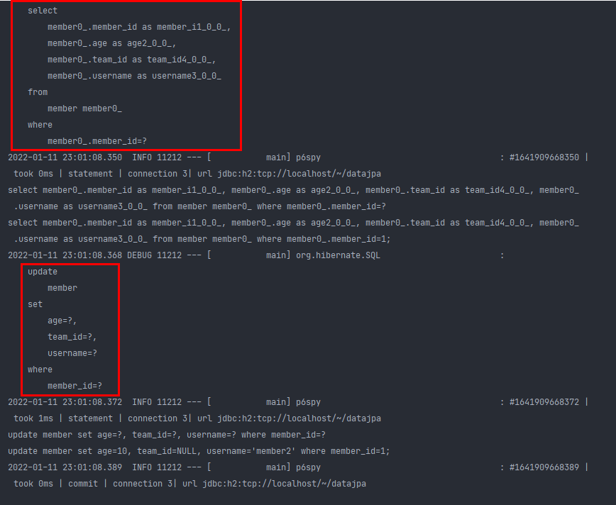

이 테스트에서는 member1을 저장하고 영속성 컨텍스트를 초기화 한다. 그리고 다시 member1을 조회해 온 뒤, member2로 이름을 바꾸고 flush를 하면 dirty checking에 의해 db로 update 쿼리가 나가게 된다.

⇒ 이것의 치명적인 단점은 변경 감지를 하려면 `원본` 이 있어야 함. (member1이 member2로 바뀌었다는 것을 알려면 원본이 뭔지 알아야 함) 그래서 메모리가 더 들어가게 된다.

(최적화가 내부적으로 많이 되있다 하더라도 결국 비용이 들게 됨.)

근데 내가 비즈니스 로직상에서 member1을 **변경하지 않고** 단순히 db에서 조회만 하고 화면에 뿌려주기만 한다면? 

```java
Member findMember = memberRepository.findById(member1.getId()).get();
```

이미 위 로직에서는 findById로 db에서 가져오기만 해도 이미 원본 객체와 바뀔 객체를 만들어 두게 된다.

**그래서 내가 로직을 짤때 얘는 100% 조회용으로만 쓴다면 얘를 최적화할 방법이 있음.**

(hibernate에서는 기능을 제공하는데, JPA에서 표준으로 제공하고 있지는 않음)

```java
public interface MemberRepository extends JpaRepository<Member, Long> {

	...

	@QueryHints(value = @QueryHint(name = "org.hibernate.readOnly", value = "true"))
	Member findReadOnlyByUsername(String username);
}
```

@QueryHints안에 @QueryHint로 readOnly를 true 해주면 내부적으로 성능 최적화를 진행하면서 스냅샷을 만들지 않음. 

```java
@Test
	public void queryHint() {
		// given
		Member member1 = new Member("member1", 10);
		memberRepository.save(member1);
		em.flush();
		em.clear();

		// when
		Member findMember = memberRepository.findReadOnlyByUsername("member1");
		findMember.setUsername("member2");

		em.flush();
	}
```

그래서 `findMember.setUsername(”member2”);` 이렇게 변경해도,  readOnly가 true 이므로변경 되지 않는다고 생각하고 무시한다.

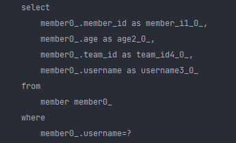

update 쿼리가 나가지 않고 조회만 함. (변경 감지 체크를 하지않음 → 스냅샷이 없기 때문)

근데 이정도의 쿼리 힌트로 인한 조회 성능 최적화는 잘 쓰이진 않음. 

결국 실무에 가면 정말 엄청나게 트래픽이 많다. 

> 암달의 법칙이라는게 있음. 전체속 부분으로 굉장히 작은 부분이 애플리케이션으로 차지하고 있다. 그 때 이 애플리케이션에 조회용으로 쓴다고 모두 readOnly 옵션을 쓰면 해봤자 성능이 얼마 좋아지지 않음.
>

전체 100 중 진짜 성능이 느린건 몇 퍼센트가 안된다. (물론 db를 잘못날려서 느린 경우를 제외하고 → 90% 이상이 db 쿼리를 잘못 날려서 장애가 발생)

결국 이 readOnly 옵션은 진짜 트래픽이 많고 정말 중요한 조회 몇군데에만 적용하지 전부다 넣는건 애매함. ⇒ 이런거는 감으로 해결하기 보다는 **성능 테스트를 진행한 뒤 결정**한다.

> 결국 진짜 성능이 딸린다면 이미 캐시나 레디스를 앞에 깔아야 함. 그래서 readOnly를 써서 얻는 이점이 크지 않음.
>

참고 : 쿼리 힌트 Page 추가 예제

```java
@QueryHints(value = { @QueryHint(name = "org.hibernate.readOnly",
						value = "true")},
						forCounting = true)
Page<Member> findByUsername(String name, Pagable pageable);
```

`forCounting` : 반환 타입으로 `Page` 인터페이스를 적용하면 추가로 호출하는 페이징을 위한 count 쿼리도 쿼리 힌트를 적용 한다. (기본값이 true임)

**Lock** 

```java
public interface MemberRepository extends JpaRepository<Member, Long> {

	...
	@Lock(LockModeType.PESSIMISTIC_WRITE)
	List<Member> findLockByUsername(String username);
}
```

```java
@Test
public void lock() {
	// given
	Member member1 = new Member("member1", 10);
	memberRepository.save(member1);
	em.flush();
	em.clear();

	// when
	List<Member> result = memberRepository.findLockByUsername("member1");
}
```

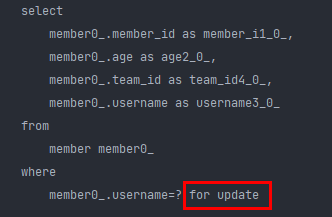

JPA가 제공하는 락인 @Lock을 쓰면 편리하게 락을 사용할 수 있음. (for update → lock을 이용하여 동시성 문제 해결하는 쿼리이다.)

JPA가 제공하는 락은 JPA 책 16.1 트랜잭션과 락 절을 참고

> 참고: 실시간 트래픽이 많은 서비스에서는 이 Lock을 쓰면 안됨. 특히 PESSIMISTIC LOCK을 걸어버리면 select에 손대기만 해도 다 Lock이 걸려버린다. (돈을 맞추는 서비스의 경우에는 PESSIMISTIC LOCK을 거는게 더 나음) → 그래서 OPTIMISITC LOCK을 걸어서 실제로 락을 거는게 아니라 버저닝이라는 메커니즘으로 해결하는 방법이 있다. 또는 락을 걸지 않고 다른 방법으로 해결하는 방법으로 가야 한다.