# section 5. 확장 기능

# 1. 사용자 정의 리포지토리 구현

- 스프링 데이터 JPA 리포지토리는 인터페이스만 정의하고 구현체는 스프링이 자동 생성
- 스프링 데이터 JPA가 제공하는 인터페이스를 직접 구현하면 구현해야 하는 기능이 너무 많음
- 만약 다른 여러가지 이유로 인터페이스의 메서드를 직접 구현하고 싶다면 어떻게 해야 할까?
    - JPA 직접 사용( EntityManager )
    - 스프링 JDBC Template 사용
    - MyBatis 사용
    - 데이터베이스 커넥션 직접 사용 등등...
    - Querydsl 사용

```java
public interface MemberRepository extends JpaRepository<Member, Long> {

	List<Member> findByUsernameAndAgeGreaterThan(String username, int age);

	List<Member> findTop3HelloBy();

	// @Query(name = "Member.findByUsername")
	List<Member> findByUsername(@Param("username") String username);

	@Query("select m from Member m where m.username = :username and m.age = :age")
	List<Member> findUser(@Param("username") String username, @Param("age") int age);

	@Query("select m.username from Member m")
	List<String> findUsernameList();

	@Query("select new study.datajpa.dto.MemberDto(m.id, m.username, t.name) from Member m join m.team t")
	List<MemberDto> findMemberDto();

	@Query("select m from Member m where m.username in :names")
	List<Member> findByNames(@Param("names") Collection<String> names);

	List<Member> findListByUsername(String username); // 컬렉션

	Member findMemberByUsername(String username); // 단건

	Optional<Member> findOptionalByUsername(String username); // 단건 Optional

	@Query(value = "select m from Member m")
	Page<Member> findByAge(int age, Pageable pageable);
	// Slice<Member> findByAge(int age, Pageable pageable);

	@Modifying(clearAutomatically = true)
	@Query("update Member m set m.age = m.age + 1 where m.age >= :age")
	int bulkAgePlus(@Param("age") int age);

	@Query("select m from Member m left join fetch m.team")
	List<Member> findMemberFetchJoin();

	@Override
	@EntityGraph(attributePaths = {"team"})
	List<Member> findAll();

	@EntityGraph(attributePaths = {"team"})
	@Query("select m from Member m")
	List<Member> findMemberEntityGraph();

	// @EntityGraph(attributePaths = {"team"})
	@EntityGraph("Member.all")
	List<Member> findEntityGraphByUsername(@Param("username") String username);

	@QueryHints(value = @QueryHint(name = "org.hibernate.readOnly", value = "true"))
	Member findReadOnlyByUsername(String username);

	@Lock(LockModeType.PESSIMISTIC_WRITE)
	List<Member> findLockByUsername(String username);
}
```

만약 MemberRepository 인터페이스를 상속하면 부모를 포함한 위의 모든 메소드를 구현 해야한다..

내가 원하는 커스텀 메소드 하나만 구현하게 하고 싶다면 

```java
public interface MemberRepositoryCustom {
	List<Member> findMemberCustom(); // 스프링 데이터 JPA가 아닌, 직접 구현한 걸 쓰고 싶음.
}
```

이렇게 임의로 커스텀 인터페이스를 만들고 이걸 구현하는 클래스를 만들어야 한다.

```java
@RequiredArgsConstructor
public class MemberRepositoryImpl implements MemberRepositoryCustom{

	private final EntityManager em;

	@Override
	public List<Member> findMemberCustom() {
		return em.createQuery("select m from Member m")
			.getResultList();
	}
}
```

이렇게 MemberRepositoryImpl로 직접 구현해주고 ( MemberRepository + impl 맞춰야 함 `규칙 이다` )

```java
public interface MemberRepository extends JpaRepository<Member, Long>, 
																						MemberRepositoryCustom{
	...
}
```

MemberRepository인터페이스가 MemberRepositoryCustom 인터페이스를 상속 받도록 한다.

```java
@SpringBootTest
@Transactional
@Rollback(false)
class MemberRepositoryTest {

	...
	@Test
	public void callCustom() {
		List<Member> result = memberRepository.findMemberCustom(); 
	}

}
```

이렇게 되면 MemberRepositoryImpl가 구현한 findMemberCustom메소드를 호출하게 된다. 

> 참고 : 위와 같은 내용이 `자바` 에서 되는게 아니고 `스프링 데이터 JPA` 에서 엮어서 해주는 거임.
> 

이런식으로 사용자 정의된 메소드를 만들면 된다. (복잡한 쿼리나 직접 db에 붙어야 하는경우에 많이 슴)

⇒ 특히 QueryDSL에서 이렇게 커스텀해서 많이 씀. (가끔 Spring JDBC Template도 Custom해서 섞어서 씀.)

> findById나 @Query 로 간단하게 쿼리를 처리할 수 있으면 스프링 데이터 JPA 인터페이스에 메소드를 구현하면 되는데, **정말 복잡한 쿼리들은 스프링 데이터 JPA가 제공하는 인터페이스의 메소드만으로 구현할 수 없기 때문에 사용자 정의 메소드를 만들어서 사용하는 거다.**
> 

**사용자 정의 구현 클래스** 

- 규칙 : 레포지토리 인터페이스 이름 + `impl`
- 스프링 데이터 JPA가 인식해서 스프링 빈으로 등록 해줌.

**만약 Impl 대신 다른 이름으로 변경하고 싶다면?**

→ XML 설정

```xml
<repositories base-package="study.datajpa.repository"
repository-impl-postfix="Impl" />
```

→ JavaConfig 설정

```java
@EnableJpaRepositories(basePackages = "study.datajpa.repository",
repositoryImplementationPostfix = "Impl")
```

repositoryImplementationPostfix를 바꿔주면 됨.

> 참고 : 왠만하면 이렇게 억지로 바꾸지말고 관례를 따르는게 좋음 →  유지보수 때문
> 

> 참고 : 핵심 비즈니스 로직이랑 단순하게 화면에 맞춘 쿼리는 분리할 필요가 있음
> 

위와 같이 MemberRepository와 MemberRepositoryCustom 등등 굉장히 많은 리포지토리들이 생기면 복잡하고 지저분해진다. ⇒ 핵심 비즈니스 로직에서 어떤걸 써야할지 헷갈리게 됨. 

핵심 비즈니스 로직을 위한 리포지토리와 / 화면을 위한 리포지토리(DTO를 뽑아 내는 작업)를 아얘  `분리` 하는게 맞다. 

(사용자 정의 되로 Custom으로 분리하는건 결국은 분리되는게 아니라 MemberRepository의 기능을 다 가지고 있기 때문에 합쳐지게 되는 꼴임)

> 결론 : 항상 사용자 정의 리포지 토리가 필요한 것이 아님. 그냥 임의의 리포지토리를 만들어도 된다. 예를들어 MemberQueryRepository를 인터페이스가 아닌 클래스로 만들고 스프링 빈으로 등록해서 그냥 직접 사용해도 된다. 물론 이 경우 스프링 데이터 JPA와는 아무런 관계 없이 별도로 동작한다.
> 

```java
@Repository
@RequiredArgsConstructor
public class MemberQueryRepository {

	private final EntityManager em;

	List<Member> findAllMembers() {
		return em.createQuery("select m from Member m") // 화면을 위한 복잡한 쿼리 라고 생각하자.
			.getResultList();
	}
}

```

```java
@SpringBootTest
@Transactional
@Rollback(false)
class MemberRepositoryTest {

	@Autowired
	MemberQueryRepository memberQueryRepository;

	...

}
```

그냥 클래스로 `@Repository`로 빈 등록을 해주고 화면에 맞는 복잡한 쿼리를 짜고, 사용하면 된다.

### 사용자 정의 리포지토리 구현 최신 방식

스프링 데이터 2.x 부터는 사용자 정의 구현 클래스에 리포지토리 인터페이스 이름 + Impl 을 적용하는 대신에 사용자 정의 인터페이스 명 + Impl 방식도 지원한다. 예를 들어서 위 예제의 MemberRepositoryImpl 대신에 MemberRepositoryCustomImpl 같이 구현해도 된다.

**최신 사용자 정의 인터페이스 구현 클래스 예제**

```java
@RequiredArgsConstructor
public class MemberRepositoryCustomImpl implements MemberRepositoryCustom {
	private final EntityManager em;
	@Override
	public List<Member> findMemberCustom() {
		return em.createQuery("select m from Member m")
			.getResultList();
	}
}
```

기존 방식보다 이 방식이 사용자 정의 인터페이스 이름과 구현 클래스 이름이 비슷하므로 더 직관적이다. 추가로 여러 인터페이스를 분리해서 구현하는 것도 가능하기 때문에 새롭게 변경된 이 방식을 사용하는 것을 더 권장한다.

# 2. Auditing

- 엔티티를 생성, 변경할 때 변경한 사람과 시간을 추적하고 싶다면?
    - 등록일
    - 수정일
    - 등록자
    - 수정자

실무에서 개발할 때 **등록일, 수정일**을 남겨두면 굉장히 편하다. (이력 추적이 가능) ⇒ 모든 테이블에 공통으로 다 적용 (데이터를 수정할 일이 없는 경우는 제외)

순수 JPA의 경우, 먼저 JpaBaseEntity클래스를 만든다.

```java
public class JpaBaseEntity {

	@Column(updatable = false)
	private LocalDateTime createdDate;
	private LocalDateTime updatedDate;

	@PrePersist
	public void prePersist() {
		LocalDateTime now = LocalDateTime.now();
		createdDate = now;
		updatedDate = now; // now 값을 넣어줘야 쿼리할 때 편함 (null이면 쿼리날릴때 불편)
	}

	@PreUpdate
	public void preUpdate() {
		updatedDate = LocalDateTime.now();
	}
}
```

`@PrePersist`는 Persist하기 전에 이벤트가 발생함.

`prePersist` 할때 updateDate도 값을 등록해줘야 나중에 쿼리 날릴 때 편하다.

```java
@Entity
@Getter @Setter
@NamedEntityGraph(name = "Member.all", attributeNodes = @NamedAttributeNode("team"))
public class Member extends JpaBaseEntity{
```

그리고 Member엔티티가 JpaBaseEntity를 상속받도록 한다.

근데 그냥 돌리면 Member테이블을 만들 때, 

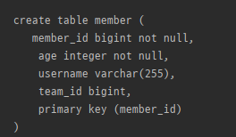

createdDate, updatedDate 필드가 만들어 지지 않는다. 

⇒ JPA 에서는 속성만 내려서 쓰는 상속이 있다. → `@MappedSuperclass`

```java
@MappedSuperclass
public class JpaBaseEntity {
```

이 애노테이션을 JpaBaseEntity클래스에 적용해주고 다시 실행하면 

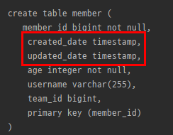

잘 적용 된다.

```java
@Test
public void JpaEventBaseEntity() throws Exception {
	//given
	Member member = new Member("member1");
	memberRepository.save(member); // @PrePersist 발생

	Thread.sleep(100);
	member.setUsername("member2");

	em.flush(); //@PreUpdate 발생
	em.clear();

	//when
	Member findMember = memberRepository.findById(member.getId()).get();

	//then
	System.out.println("findMember.createdDate = " + findMember.getCreatedDate());
	System.out.println("findMember.updatedDate = " + findMember.getUpdatedDate());
}
```

다음과 같이 “member1” 이름을 저장하고, 100ms을 쓰레드를 죽였다가 다시 “member2”를 저장하고, 이를 db에서 조회해서 비교해보면

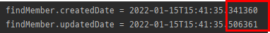

약 100ms 지난 뒤 저장된 것을 확인할 수 있다.

### JPA 주요 이벤트 어노테이션

- @PrePersist, @PostPersist
- @PreUpdate, @PostUpdate

### 스프링 데이터 JPA 사용하기

스프링 데이터 JPA는 순수 JPA보다 더 깔끔하게 사용할 수 있도록 함.

**설정**

`@EnableJpaAuditing` 스프링 부트 설정 클래스에 적용해야함
`@EntityListeners(AuditingEntityListener.class)` 엔티티에 적용

```java
@EnableJpaAuditing
@SpringBootApplication
public class DataJpaApplication {

	public static void main(String[] args) {
		SpringApplication.run(DataJpaApplication.class, args);
	}

}
```

```java
@Getter
@MappedSuperclass
@EntityListeners(AuditingEntityListener.class)
public class BaseEntity {

	@CreatedDate
	@Column(updatable = false)
	private LocalDateTime createdDate;

	@LastModifiedDate
	private LocalDateTime lastModifiedDate;
}
```

```java
@Entity
@Getter @Setter
public class Member extends BaseEntity{
```

이렇게만 해주면 끝난다. 

`@EntityListeners(AuditingEntityListener.class)` → 이벤트 기반으로 동작한다는 것을 알려줌.

등록자, 수정자도 쉽게 할 수 있다.

```java
@Getter
@MappedSuperclass
@EntityListeners(AuditingEntityListener.class)
public class BaseEntity {

	@CreatedDate
	@Column(updatable = false)
	private LocalDateTime createdDate;

	@LastModifiedDate
	private LocalDateTime lastModifiedDate;

	@CreatedBy
	@Column(updatable = false)
	private String createdBy;

	@LastModifiedBy
	private String lastModifiedBt;
}
```

`@CreatedBy` 와 `@LastModifiedBy` 애노테이션을 이용하여 필드를 만들고 

```java
@EnableJpaAuditing
@SpringBootApplication
public class DataJpaApplication {

	public static void main(String[] args) {
		SpringApplication.run(DataJpaApplication.class, args);
	}

	@Bean
	public AuditorAware<String> auditorProvider() {
		return new AuditorAware<String>() {
			@Override
			public Optional<String> getCurrentAuditor() {
				return Optional.of(UUID.randomUUID().toString());
			}
		};
	}
}
```

등록자 수정자를 처리해주는 `AuditorAware`를 스프링 빈으로 등록한다. 

위와 같이 익명 클래스로 구현 된 것을 람다로 바꾸면

```java
@EnableJpaAuditing
@SpringBootApplication
public class DataJpaApplication {

	public static void main(String[] args) {
		SpringApplication.run(DataJpaApplication.class, args);
	}

	@Bean
	public AuditorAware<String> auditorProvider() {
		return () -> Optional.of(UUID.randomUUID().toString());
	}
}
```

이렇게 간단하게 표시할 수 있다.

> 실무에서는 세션 정보나, 스프링 시큐리티 로그인 정보에서 ID를 받음
> 

이렇게 빈을 등록해주면 등록, 수정 될 때마다 auditorProvider()를 호출해서 결과물을 createdBy, lastModifiedBt에다가 채워준다.

```java
@Test
public void JpaEventBaseEntity() throws Exception {
	//given
	Member member = new Member("member1");
	memberRepository.save(member); // @PrePersist 발생

	Thread.sleep(100);
	member.setUsername("member2");

	em.flush(); //@PreUpdate 발생
	em.clear();

	//when
	Member findMember = memberRepository.findById(member.getId()).get();

	//then
	System.out.println("findMember.createdDate = " + findMember.getCreatedDate());
	System.out.println("findMember.updatedDate = " + findMember.getLastModifiedDate());
	System.out.println("findMember.craetedBy = " + findMember.getCreatedBy());
	System.out.println("findMember.updatedBy = " + findMember.getLastModifiedBy());
}
```

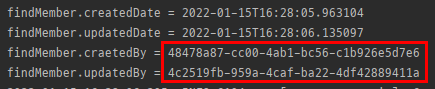

UUID가 랜덤하게 잘 들어가는걸 확인할 수 있다.

> 참고: 실무에서 대부분의 엔티티는 등록시간, 수정시간이 필요하지만, 등록자, 수정자는 없을 수도 있다. 그래서 다음과 같이 Base 타입을 분리하고, 원하는 타입을 선택해서 상속한다.
> 

```java
@Getter
@MappedSuperclass
@EntityListeners(AuditingEntityListener.class)
public class BaseTimeEntity {
	@CreatedDate
	@Column(updatable = false)
	private LocalDateTime createdDate;
	@LastModifiedDate
	private LocalDateTime lastModifiedDate;
}

@Getter
@MappedSuperclass
@EntityListeners(AuditingEntityListener.class)
public class BaseEntity extends BaseTimeEntity {
	@CreatedBy
	@Column(updatable = false)
	private String createdBy;
	@LastModifiedBy
	private String lastModifiedBy;
}
```

> 참고: 저장시점에 등록일, 등록자는 물론이고, 수정일, 수정자도 같은 데이터가 저장된다. 데이터가 중복 저장되는 것 같지만, 이렇게 해두면 변경 컬럼만 확인해도 마지막에 업데이트한 유저를 확인 할 수 있으므로 유지보수 관점에서 편리하다. 이렇게 하지 않으면 변경 컬럼이 null 일때 등록 컬럼을 또 찾아야 한다. 참고로 저장시점에 저장데이터만 입력하고 싶으면 `@EnableJpaAuditing(modifyOnCreate = false)` 옵션을 사용하면 된다.
> 

### 전체 적용

`@EntityListeners(AuditingEntityListener.class)` 를 생략하고 스프링 데이터 JPA 가 제공하는
이벤트를 엔티티 전체에 적용하려면 orm.xml에 다음과 같이 등록하면 된다.

`META-INF/orm.xml`

```xml
<?xml version=“1.0” encoding="UTF-8”?>
<entity-mappings xmlns=“http://xmlns.jcp.org/xml/ns/persistence/orm”
								 xmlns:xsi=“http://www.w3.org/2001/XMLSchema-instance”
								 xsi:schemaLocation=“http://xmlns.jcp.org/xml/ns/persistence/
orm http://xmlns.jcp.org/xml/ns/persistence/orm_2_2.xsd”
								 version=“2.2">

		<persistence-unit-metadata>
				<persistence-unit-defaults>
						<entity-listeners>
							<entity-listener
class="org.springframework.data.jpa.domain.support.AuditingEntityListener”/>
						</entity-listeners>
			 </persistence-unit-defaults>
		</persistence-unit-metadata>

</entity-mappings>
```

# 3.  Web 확장 - 도메인 클래스 컨버터

HTTP 파라미터로 넘어온 엔티티의 아이디로 엔티티 객체를 찾아서 바인딩

```java
@RestController
@RequiredArgsConstructor
public class MemberController {

	private final MemberRepository memberRepository;

	@GetMapping("/members/{id}")
	public String findMember(@PathVariable("id") Long id) {
		Member member = memberRepository.findById(id).get();
		return member.getUsername();
	}

	@PostConstruct
	public void init() {
		memberRepository.save(new Member("user"));
	}
}
```

원래는 @PathVariable로 id를 받아서 member를 찾아왔다.

```java
@RestController
@RequiredArgsConstructor
public class MemberController {

	private final MemberRepository memberRepository;

	...

	@GetMapping("/members2/{id}")
	public String findMember2(@PathVariable("id") Member member) {
		return member.getUsername();
	}

	...
}
```

근데 스프링이 중간에 `Member member = memberRepository.findById(id).get();` 이렇게 converting 하는 과정을 해주고 **바로 Member member로 파라미터 인젝션** 해준다. (이게 도메인 클래스 컨버터 이다.)

→ HTTP 요청은 회원 `id` 를 받지만, 도메인 클래스 컨버터가 중간에 동작해서 회원 엔티티 객체를 반환한다.

→ 도메인 클래스 컨버터도 레포지토리를 사용해서 엔티티를 찾는다.

> 참고 : 이런 기능을 권장하진 않음. 왜냐면 이게 사실은 pk로 조회를 하는건데, 쿼리가 이렇게 생각보다 단순하게 돌아가지 않음. 간단한 경우에만 쓰고, 복잡한 경우에는 쓰기 힘들다.
> 

> 참고 : 도메인 클래스 컨버터로 엔티티를 파라미터로 받으면, 이 엔티티는 단순 조회용으로만 사용해야 한다. (트랜잭션이 없는 범위에서 엔티티를 조회했으므로, 엔티티를 변경해도 DB에 반영되지 않는다.)
> 

# 4. Web 확장 - 페이징과 정렬

스프링 데이터가 제공하는 페이징과 정렬 기능을 스프링 MVC에서 편리하게 사용할 수 있다.

```java
@RestController
@RequiredArgsConstructor
public class MemberController {

	private final MemberRepository memberRepository;

	...

	@GetMapping("/members")
	public Page<Member> list(Pageable pageable) {
		Page<Member> page = memberRepository.findAll(pageable);
		return page;
	}

	@PostConstruct
	public void init() {
		// memberRepository.save(new Member("userA"));
		for (int i = 0; i < 100; i++) {
			memberRepository.save(new Member("user" + i, i));
		}
	}
}
```

WEB에서도 Page와 Pageable 인터페이스만 넣어도 파라미터 바인딩 해서 사용할 수 있도록 제공해 준다.

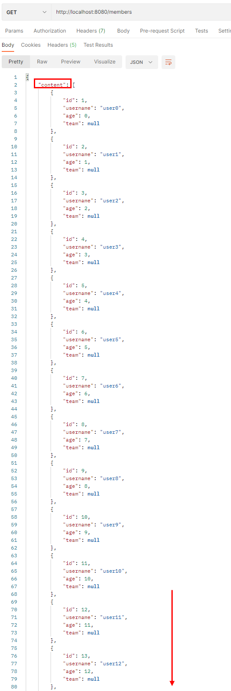

contents라는 key로 감싸져서 Member List가 쭉 출력이 된다. 

> 뒤에 쿼리 파라미터가 안붙었지만 기본적으로 Pageable 인터페이스 파라미터 바인딩으로 page 값이 0이 되므로 페이지 0번째의 값 20개가 출력된다.
> 

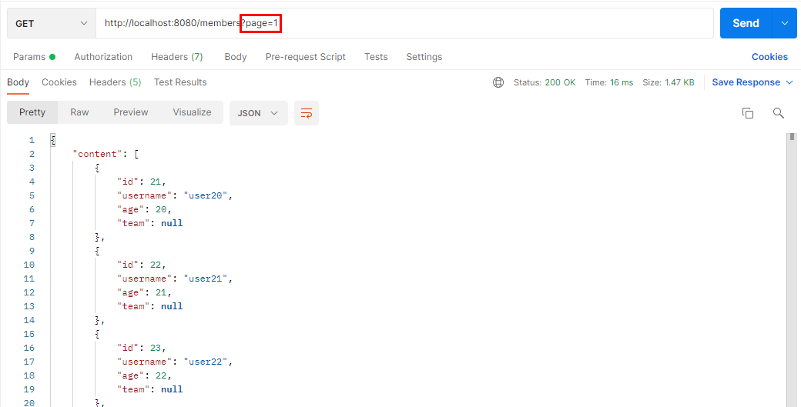

이렇게 page값을 1로 주면 21번째 부터 40까지의 id를 가진 member를 출력해 준다.

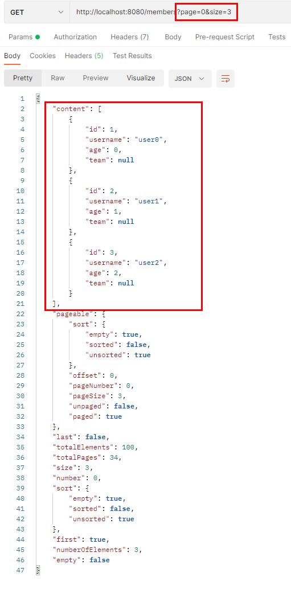

page 인덱스 0에 size 3이면 첫번째 페이지에 아이템 3개만 가져오라는 뜻이다.

이렇게 파라미터로 page와 size를 지정하면 스프링 데이터 JPA가 Pageable인터페이스의 구현체에 자동으로 셋팅해 준다.

**⇒ HTTP 파라미터들이 컨트롤러에서 파라미터 바인딩 될 때, Pageable 인터페이스가 있으면 PageRequest(`org.springframework.data.domain.PageRequest`)라는 객체를 생성해서  거기에 page와 size 값들을 채워서 Pageable 인터페이스에 Injection 해준다.** 

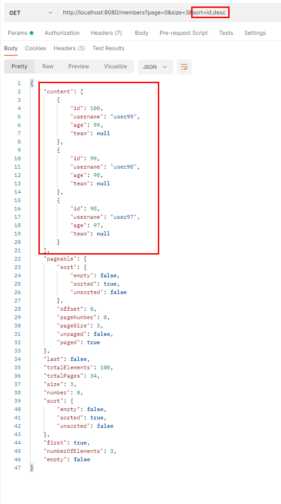

이렇게 id 기준으로 역순 정렬도 가능하다.

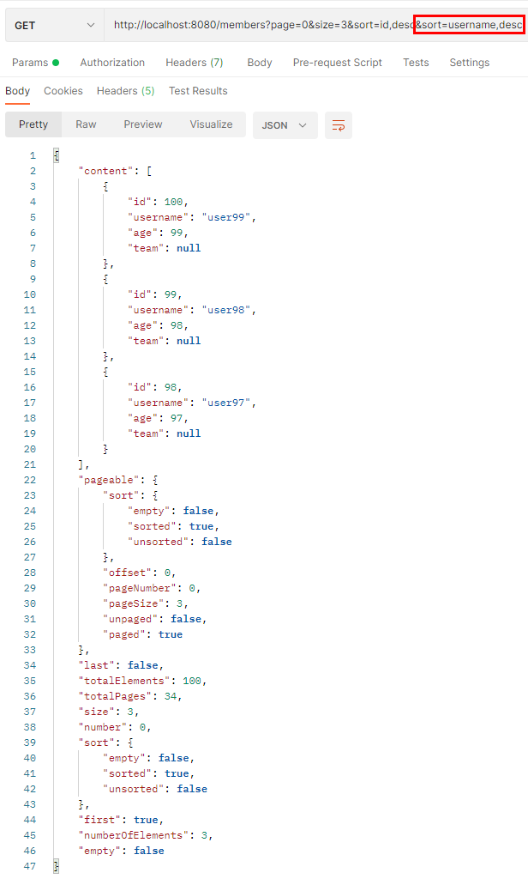

계속 sort 조건을 추가 시킬 수도 있다.

- page : 현재 페이지, **0부터 시작한다.**
- size: 한 페이지에 노출할 데이터 건수
- sort: 정렬 조건을 정의한다. 예) 정렬 속성,정렬 속성...(ASC | DESC), 정렬 방향을 변경하고 싶으면 sort 파라미터 추가 (`asc` 생략 가능)

### 글로벌 설정

⇒ 아까 조건을 하나도 넣지 않았을때 20개가 디폴트로 설정이 되어 출력되었는데, 얘를 10개로 바꾸고 싶다면?

```yaml
spring:
  data:
    web:
      pageable:
        default-page-size: 10
        max-page-size: 2000
```

`spring.data.web.pageable.default-page-size`를 10으로 바꾸면 된다.

`max-page-size` 를 지정할 수도 있다.

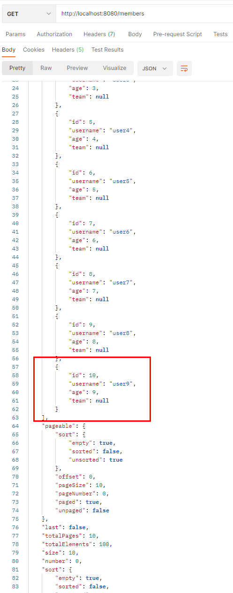

그러면 딱 10개까지만 출력 되는 것을 확인할 수 있다.

### 개별 설정

⇒ 근데 이렇게 글로벌한 설정이 아니라 해당 컨트롤러의 Pageable에만 설정하고 싶다면?

```java
@GetMapping("/members")
public Page<Member> list(@PageableDefault(size = 5, sort = "username") Pageable pageable) {
	Page<Member> page = memberRepository.findAll(pageable);
	return page;
}
```

`@PageableDefault` 이렇게 size와 sort 기준을 넣을 수 있다.

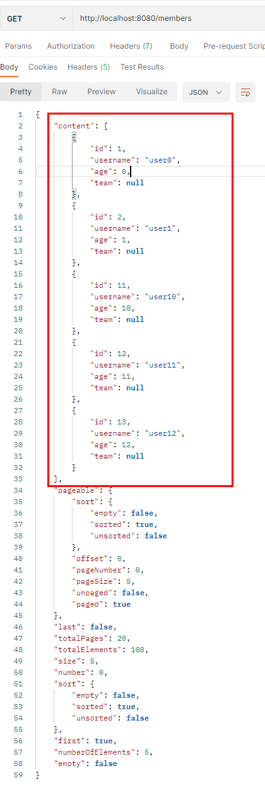

데이터가 딱 5개, 그리고 username기준으로 정렬되어 출력되는 것을 확인할 수 있다.

그리고 아래에 pageable관련된 내용들이 쭉 출력이 되는데, 실제 쿼리가 나간걸 확인해 보면

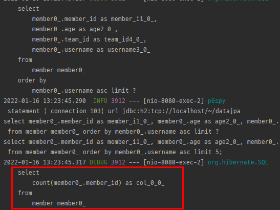

**total count 쿼리가 나간다! ⇒ 컨트롤러의 반환타입이 Page이기 때문에 그렇다.**

⇒ 결국 스프링 데이터 JPA를 이용하면 이전에 PageRequest를 직접 만드는게 아니라 스프링 데이터 JPA의 규칙에 의해 웹 파라미터가 바인딩 되고 객체를 생성해 준다.

### 접두사

- 페이징 정보가 둘 이상이면 접두사로 구분
- `@Qualifier` 에 접두사명 추가 "{접두사명}_xxx”
- 예제: `/members?member_page=0&order_page=1`

```java
public String list(
@Qualifier("member") Pageable memberPageable,
@Qualifier("order") Pageable orderPageable, ...
```

### Page 내용을 DTO로 변환하기

- 엔티티를 API로 노출하면 다양한 문제가 발생한다. 그래서 엔티티를 꼭 DTO로 변환해서 반환해야 한다.
- Page는 map() 을 지원해서 내부 데이터를 다른 것으로 변경할 수 있다.

```java
@GetMapping("/members")
public Page<MemberDto> list(@PageableDefault(size = 5, sort = "username") Pageable pageable) {
	return memberRepository.findAll(pageable)
		.map(member -> new MemberDto(member.getId(), member.getUsername(), null));
}
```

> 참고 : DTO는 엔티티를 봐도 됨. 엔티티는 가급적 DTO를 보지 않아야 함. (같은 패키지 안이면 상관없지만) DTO들은 어짜피 엔티티나 어플리케이션, 여러군데에서 보는 얘들이기 때문에 공통으로 본다.
> 

```java
@Data
public class MemberDto {

	private Long id;
	private String username;
	private String teamName;

	public MemberDto(Long id, String username, String teamName) {
		this.id = id;
		this.username = username;
		this.teamName = teamName;
	}

	public MemberDto(Member member) {
		this.id = member.getId();
		this.username = member.getUsername();
	}
}
```

이렇게 MemberDto 생성자 파라미터로 엔티티인 Member를 받아도 된다.

```java
@GetMapping("/members")
public Page<MemberDto> list(@PageableDefault(size = 5, sort = "username") Pageable pageable) {
	return memberRepository.findAll(pageable)
		.map(member -> new MemberDto(member));
}
```

그러면 MemberDto로 변환할 때 좀더 깔끔한 코드를 작성할 수 있다.

```java
@GetMapping("/members")
public Page<MemberDto> list(@PageableDefault(size = 5, sort = "username") Pageable pageable) {
	Page<MemberDto> map = memberRepository.findAll(pageable)
		.map(MemberDto::new);
	return map;
}
```

람다 레퍼런스로 바꾸면 더 깔끔함.

### Page를 1부터 시작하기

- 스프링 데이터는 Page를 0부터 시작한다.
- 만약 1부터 시작하려면?

1. Pageable, Page를 파리미터와 응답 값으로 사용히지 않고, 직접 클래스를 만들어서 처리한다. 그리고 직접 PageRequest(Pageable 구현체)를 생성해서 리포지토리에 넘긴다. 물론 응답값도 Page 대신에 직접 만들어서 제공해야 한다. **⇒ 궁극적인 해결 방법**
2. `spring.data.web.pageable.one-indexed-parameters` 를 `true` 로 설정한다. 그런데 이 방법은
web에서 `page` 파라미터를 `-1` 처리 할 뿐이다. 따라서 응답값인 `Page` 에 모두 0 페이지 인덱스를 사용하는 **한계가 있다.**

```yaml
spring:
  data:
    web:
      pageable:
        one-indexed-parameters: true
```

이렇게 yml 파일을 설정하고 실행해 보면 

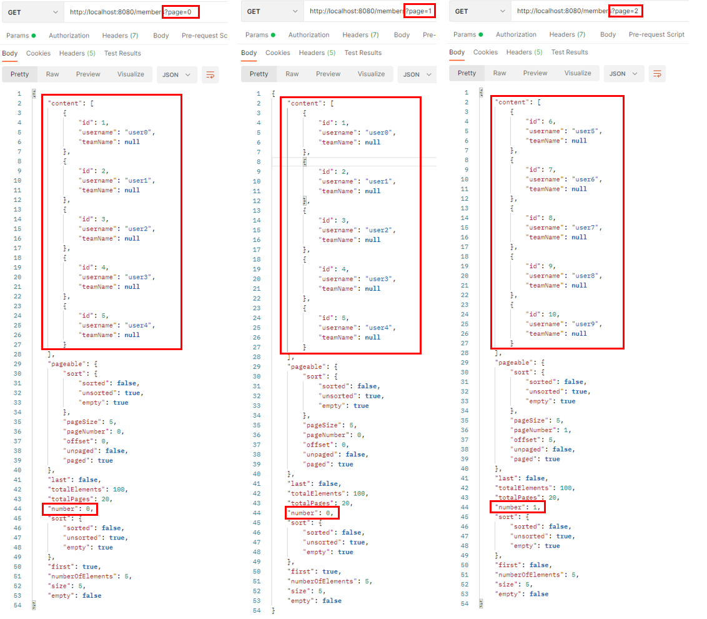

page 0일때도 첫번째 페이지 값이나온다. (page가 0일때 page 1일때 출력과 같도록 설정해 둠 → 잘못 입력할 수 있으니)

그리고 page 2부터 두번째 페이지 값이 잘 나온다.

근데 pageable에서 나온 정보가 맞지가 않다. page 1이면 number가 1이여야 하는데, 인덱스가 0부터 시작된다. (우리가 바꾼 설정대로 나오지 않음)

⇒ 이런걸 감안 하고 쓰면 상관없지만 가급적 페이지 인덱스를 0부터 시작하도록 사용하는게 제일 깔끔하다. 아니면 페이지에 대한 반환스타일을 우리가 커스텀한 객체를 만들어서 페이지를 반환해야 한다.