# section 6. 스프링 데이터 JPA 분석

# 1. 스프링 데이터 JPA 구현체 분석

스프링 데이터 JPA가 제공하는 공통 인터페이스의 구현체

⇒ `org.springframework.data.jpa.repository.support.SimpleJpaRepository`

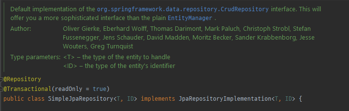

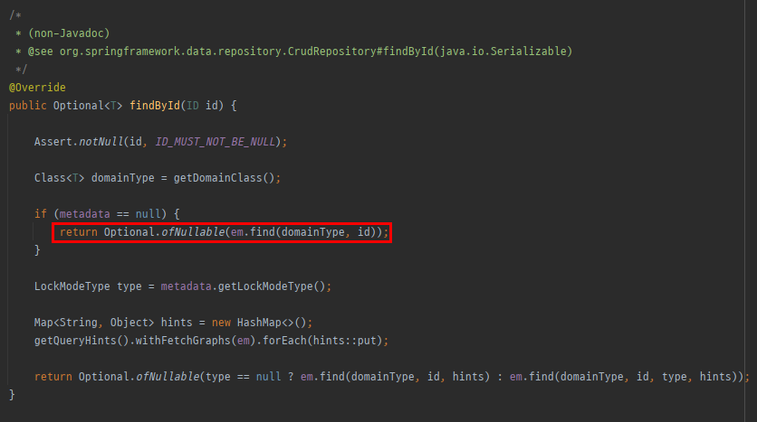

결국 JPA내부 기능을 활용해서 동작하게 구현한 것이다.

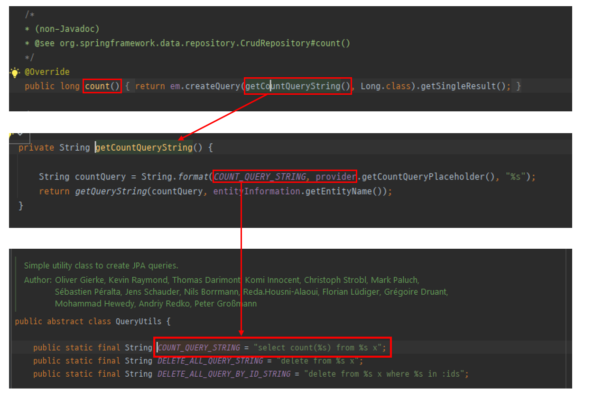

카운트 쿼리의 경우 QueryUtils에서 String으로 대신 쿼리를 제공하여 해결함. (이거는 JPA에서 제공해주는 건 아님)

> 참고 :  `조회` 에 대한 기능은 JPA를 사용함.
> 

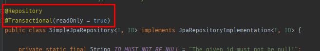

SimpleJpaRepository에 애노테이션으로 `@Repository`가 달려있는데,

1. 스프링 빈의 컴포넌트 스캔 대상이 됨. → 컨테이너에 등록됨.
2. JPA, JDBC가 예외가 터지면 영속성에 있는 예외들이 다 각기 다른데, 이걸 스프링에서 추상화한 예외로 바꿔줌. (그래서 서비스, 컨트롤러 계층에서 예외를 넘길때, JPA 예외가 넘어가는게 아니라 스프링의 예외로 넘어간다. ⇒ 결론적으로 하부 기술을 JPA에서 JDBC로 바꿔도 예외를 처리하는 로직이 동일하다)

그리고 `@Transactional` 애노테이션이 달려있는데, 스프링 데이터 JPA는 우선 트랜잭션을 걸고 시작한다는 뜻이 된다. 기본적으로 readOnly로 읽기 전용으로 선언 되어있음.

but 저장하는 로직의 경우 

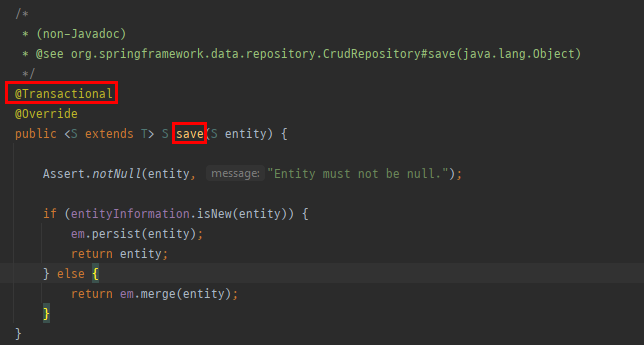

오버라이드 하여 메서드 레벨에 다시 트랜잭션 어노테이션을 붙인다. (읽기 전용을 붙이지 않고)

JPA에서의 모든 데이터 변경은 **트랜잭션** 안에서 일어나야 한다. 근데 스프링 데이터 JPA를 쓰면 그냥 트랜잭션이 실행 된다. (왜냐면 구현체인 `SimpleJpaRepository` 에서 트랜잭션이 등록 되어있기 때문)

**@Transactional 트랜잭션 적용**

- JPA의 모든 변경은 트랜잭션 안에서 동작
- 스프링 데이터 JPA는 변경(등록, 수정, 삭제) 메서드를 트랜잭션 처리
- **서비스 계층에서 트랜잭션을 시작하지 않으면 리파지토리에서 트랜잭션 시작**
- **서비스 계층에서 트랜잭션을 시작하면 리파지토리는 해당 트랜잭션을 전파 받아서 사용**
- **그래서 스프링 데이터 JPA를 사용할 때 트랜잭션이 없어도 데이터 등록, 변경이 가능했음(사실은 트랜잭션이 리포지토리 계층에 걸려있는 것임)**

**@Transactional(readOnly = true)**

- 데이터를 단순히 조회만 하고 변경하지 않는 트랜잭션에서 `readOnly = true` 옵션을 사용하면 **플러시를 생략**해서 약간의 성능 향상을 얻을 수 있음
- 자세한 내용은 JPA 책 15.4.2 읽기 전용 쿼리의 성능 최적화 참고

### 매우 중요 !!!

**`save() 메서드`**

- 새로운 엔티티면 저장(`persist`)
- 새로운 엔티티가 아니면 병합(`merge`)

```java
@Transactional
@Override
public <S extends T> S save(S entity) {

	Assert.notNull(entity, "Entity must not be null.");

	if (entityInformation.isNew(entity)) {
		em.persist(entity);
		return entity;
	} else {
		return em.merge(entity);
	}
}
```

**save 동작원리** : 엔티티가 db select해서 꺼내 진적이 없다면 persist하고, db select해서 꺼내진 것이라면 merge 시킨다**. ⇒ db에 한번 쿼리를 하는게 단점임.** 

가급적 merge는 쓰면 안된다. 데이터 변경은 변경 감지를 사용해야 한다. 

> 참고 : **merge는 영속상태의 엔티티가 어떤 이유로 영속 상태를 벗어 났다면 다시 영속 상태가 되야 할 때 쓰는 거다. (데이터를 업데이트 할 때 쓰는 건 권장하지 않는다.)**
> 

# 2. 새로운 엔티티를 구별하는 방법

- 새로운 엔티티를 판단하는 기본 전략
    - 식별자가 객체일 때 `null` 로 판단 (Long)
    - 식별자가 자바 기본 타입일 때 `0` 으로 판단 (long)
    - `Persistable` 인터페이스를 구현해서 판단 로직 변경 가능

예시

```java
@Entity
@Getter
public class Item {

	@Id @GeneratedValue
	private Long id;
}
```

```java
@Test
public void save() {
	Item item = new Item();
	itemRepository.save(item);
}
```

다음과 같이 Item을 save 한다면 

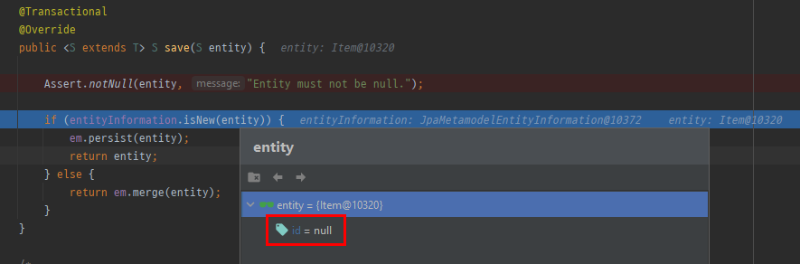

id가 null 이기 때문에 처음에는 persist 한다.

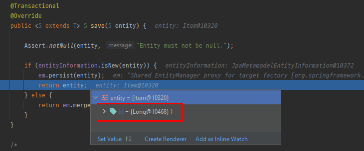

persist 해야 @GeneratedValue가 동작하여 id가 null에서 1로 증가한다.

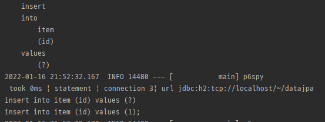

그리고 insert 쿼리 하나만 날린다. (조회 쿼리가 나가지 않음)

근데 여기서 문제는 

```java
@Entity
@Getter
public class Item {

	@Id
	private String id;
}
```

`@GeneratedValue`를 쓰지 않고 id를 임의로 만들어서 넣는다고 생각해 보자.

```java
@Test
public void save() {
	Item item = new Item("A");
	itemRepository.save(item);
}
```

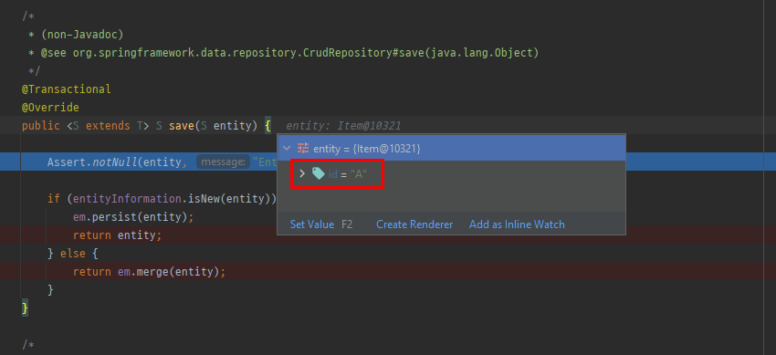

이미 id값이 들어 있기 때문에 isNew가 false로 판단하여 merge를 수행하게 됨.

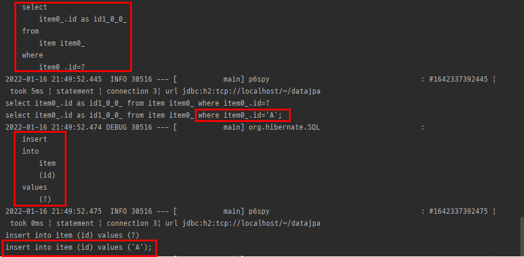

그래서 A가 있는지 조회를 하고 insert 쿼리를 날린다. ⇒ 조회 쿼리를 날리 므로 비효율 적임. (**merge는 db에 있을 거라고 가정하고 select 쿼리를 날리기 때문이다.**)

**결론**

**데이터 변경 → 변경 감지 사용해야 함.’**

**데이터 저장 → persist 써야함**

우리가 merge를 쓸 상황은 거의없다. 굉장히 특수한 상황임. (엔티티가 detached 된 상황에서 다시 붙일 때 사용 → 사실 상 그럴 경우가 거의 없음)

기본적으로 실무에서 식별자를 `@GeneratedValue`로 깔고 가는데, 데이터가 많아지고 테이블이 어쩔 수 없이 분리되면서 **id를 내가 직접 생성해야 하는 경우가 생길 수 있다.**

그럴 때는 **스프링 데이터 JPA가 제공하는 `Persistable` 인터페이스를 사용해야 한다.**

```java
@Entity
@NoArgsConstructor(access = AccessLevel.PROTECTED)
public class Item implements Persistable<String> {

	@Id
	private String id;

	public Item(String id) {
		this.id = id;
	}

	@Override
	public String getId() {
		return id;
	}

	@Override
	public boolean isNew() {
		// 로직 짜야 함.
		return false;
	}
}
```

여기서 isNew 메소드 로직을 짜야 하는데, 보통 다음과 같이 짠다.

```java
@Entity
@EntityListeners(AuditingEntityListener.class) // 넣어 줘야 @CreatedDate 가 먹힘.
@NoArgsConstructor(access = AccessLevel.PROTECTED)
public class Item implements Persistable<String> {

	@Id
	private String id;

	@CreatedDate
	private LocalDateTime createdDate;

	public Item(String id) {
		this.id = id;
	}

	@Override
	public String getId() {
		return id;
	}

	@Override
	public boolean isNew() {
		return createdDate == null;
	}
}
```

`@createdDate` ← JPA에서 제공 되는 애노테이션이다. 얘는 기본적으로 persist 되기 전에 작동하기 때문에, 이 필드를 기준으로 isNew에서 createdDate가 null이라면 아직 persist 되지 않은 엔티티기 때문에 true가 반환되는 형태의 로직을 구현할 수 있다.

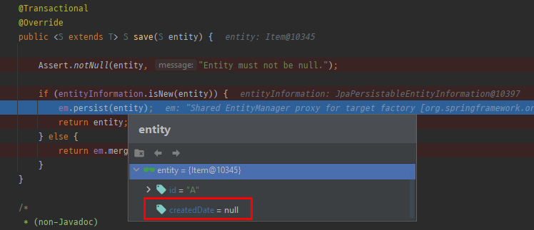

persist 전까지는 null이였다가

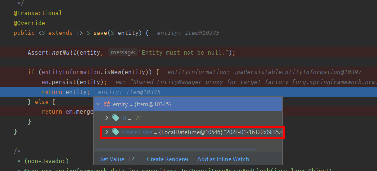

persist 이후 createdDate 값이 들어가 있는 걸 확인할 수 있다. (JPA 이벤트 안에서 동작함)

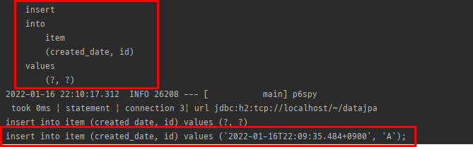

insert 쿼리도 잘 동작한다.

**⇒ 실무에서 이런 식으로 inNew를 풀어냄.**