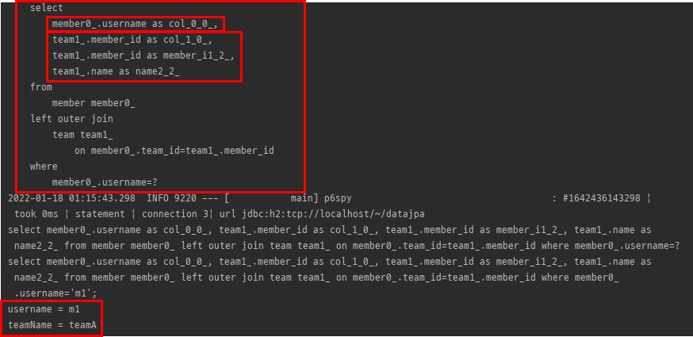

# section 7. 나머지 기능들

# 1. Specifications (명세)

책 도메인 주도 설계(Domain Driven Design)는 SPECIFICATION(명세)라는 개념을 소개한다.

스프링 데이터 JPA는 JPA Criteria를 활용해서 이 개념을 사용할 수 있도록 지원 (but 가독성이 현저히 떨어지기 때문에 **실무에서 사용 안하는게 맞다. 가볍게 알아 두자.**)

**술어(predicate)**

- 참 또는 거짓으로 평가
- AND OR 같은 연산자로 조합해서 다양한 검색조건을 쉽게 생성(컴포지트 패턴) ⇒ 예) 검색 조건 하나하나
- 스프링 데이터 JPA는 `org.springframework.data.jpa.domain.Specification` 클래스로 정의

```java
public interface MemberRepository extends JpaRepository<Member, Long>, MemberRepositoryCustom,
	JpaSpecificationExecutor {
```

`JpaSpecificationExecutor` 인터페이스를 구현한다.


findOne, findAll 메소드를 제공해주는데, 파라미터로 Specification을 받아서 검색조건으로 사용 한다. (JPA Criteria 기술을 조립하여 사용하도록 만들어 둔 **명세**임.)

**명세 사용 코드**

```java
@Test
public void specBasic() {
	// given
	Team teamA = new Team("teamA");
	em.persist(teamA);

	Member m1 = new Member("m1", 0, teamA);
	Member m2 = new Member("m2", 0, teamA);
	em.persist(m1);
	em.persist(m2);

	em.flush();
	em.clear();

	// when
	Specification<Member> spec = MemberSpec.username("m1").and(MemberSpec.teamName("teamA"));
	List<Member> result = memberRepository.findAll(spec);
	Assertions.assertThat(result.size()).isEqualTo(2);
}
```

- `Specification`을 구현하면 명세들을 조립할 수 있음. `where()` , `and()` , `or()` , `not()` 제공
- `findAll` 을 보면 회원 이름 명세(`username`)와 팀 이름 명세(`teamName`)를 `and` 로 조합해서 검색 조건으로 사용

**`MemberSpec` 명세 정의 코드**

```java
public class MemberSpec {

	public static Specification<Member> teamName(final String teamName) {
		return (Specification<Member>) (root, query, builder) -> {
			if (StringUtils.isEmpty(teamName)) {
				return null;
			}
			Join<Member, Team> t = root.join("team", JoinType.INNER); //회원과 조인
			return builder.equal(t.get("name"), teamName);
		};
	}

	public static Specification<Member> username(final String username) {
		return (Specification<Member>) (root, query, builder) ->
			builder.equal(root.get("username"), username);
	}
}
```

- 명세를 정의하려면 `Specification` 인터페이스를 구현해야 함
- 명세를 정의할 때는 `toPredicate(...)` 메서드만 구현하면 되는데 JPA Criteria의 `Root`, `CriteriaQuery`, `CriteriaBuilder` 클래스를 파라미터로 제공한다.
- 예제에서는 편의상 람다를 사용

⇒ 장점은 자바 코드로 SQL을 작성할 수 있다.

but 구현 기술에 JpaCriteria를 쓰는데, 너무 복잡해서 직관적이지 않고 이해하기 힘듦. (실무에서 사용하기에는 너무 번잡하다.)

> **참고: 실무에서는 JPA Criteria를 거의 안쓴다! 대신에 QueryDSL을 사용하자.**
> 

# 2. Query By Example

공식 문서 : [https://docs.spring.io/spring-data/jpa/docs/current/reference/html/#query-by-example](https://docs.spring.io/spring-data/jpa/docs/current/reference/html/#query-by-example)


JpaRepository가 QueryByExampleExecutor를 구현하기 때문에 사용 가능.

예시 코드

```java
@Test
public void queryByExample() {
	// given
	Team teamA = new Team("teamA");
	em.persist(teamA);

	Member m1 = new Member("m1", 0, teamA);
	Member m2 = new Member("m2", 0, teamA);
	em.persist(m1);
	em.persist(m2);

	em.flush();
	em.clear();

	// when
	// Probe
	Member member = new Member("m1"); // 멤버 엔티티 자체가 검색 조건이 됨. (저장 용이 아니라 검색용 도메인 객체로 만든다)
	Example<Member> example = Example.of(member); // example을 멤버 엔티티로 만든다.

	List<Member> result = memberRepository.findAll(example); // 검색 조건을 이용한 example로 원하는 결과를 찾아 온다.

	assertThat(result.get(0).getUsername()).isEqualTo("m1");
}
```


username을 m1 기준으로 찾게 된다. (근데 age로도 조건을 걸고 찾아옴)

이렇게 도메인 객체인 Member에 username을 검색조건으로 만들었는데, Member 엔티티의 필드로 id, username,  age가 있다. id는 null이므로 상관이없지만 username과 age는 null이 아님. 여기서 username으로 검색조건을 정했다면, age는 무시해 줘야 한다.

```java
@Test
public void queryByExample() {
	// given
	Team teamA = new Team("teamA");
	em.persist(teamA);

	Member m1 = new Member("m1", 0, teamA);
	Member m2 = new Member("m2", 0, teamA);
	em.persist(m1);
	em.persist(m2);

	em.flush();
	em.clear();

	// when
	// Probe
	Member member = new Member("m1"); // 멤버 엔티티 자체가 검색 조건이 됨. (저장 용이 아니라 검색용 도메인 객체로 만든다)

	ExampleMatcher matcher = ExampleMatcher.matching()
		.withIgnorePaths("age"); // age 라는 속성은 다 무시한다.

	Example<Member> example = Example.of(member, matcher); // example을 멤버 엔티티로 만든다.

	List<Member> result = memberRepository.findAll(example); // 검색 조건을 이용한 example로 원하는 결과를 찾아 온다.

	assertThat(result.get(0).getUsername()).isEqualTo("m1");
}
```

`withIgnorePaths` 로 age 속성을 무시하면


age를 무시하고 username만으로 찾아오게 된다.

⇒ 이런 기술이 되게 신개념이긴 한데, 결국 Join 쿼리에서 해결이 잘 안됨. (inner join은 되는데, outer join이 안됨.)

> 보통 이런 db 기술들을 하드하게 선정하고 파고 들건지를 결정하는 요인으로 Join이 잘 해결되지 않는다면, 실무에 도입하지 않는다.
> 

```java
@Test
public void queryByExample() {
	// given
	Team teamA = new Team("teamA");
	em.persist(teamA);

	Member m1 = new Member("m1", 0, teamA);
	Member m2 = new Member("m2", 0, teamA);
	em.persist(m1);
	em.persist(m2);

	em.flush();
	em.clear();

	// when
	// Probe
	Member member = new Member("m1"); 
	Team team = new Team("teamA"); // 내부 조인으로 teamA 가능
	member.setTeam(team); 

	ExampleMatcher matcher = ExampleMatcher.matching()
		.withIgnorePaths("age"); // age 라는 속성은 다 무시한다.

	Example<Member> example = Example.of(member, matcher); // example을 멤버 엔티티로 만든다.

	List<Member> result = memberRepository.findAll(example); // 검색 조건을 이용한 example로 원하는 결과를 찾아 온다.

	assertThat(result.get(0).getUsername()).isEqualTo("m1");
}
```


이렇게 inner join까지는 잘 된다.

- Probe : 필드에 데이터가 있는 실제 도메인 객체
- ExampleMatcher : 특정 필드를 일치시키는 상세한 정보 제공, 재사용 가능
- Example : Probe와 ExampleMatcher로 구성, 쿼리를 생성하는데 사용

**장점**

- 동적 쿼리를 편리하게 처리
- 도메인 객체를 그대로 사용
- 데이터 저장소를 RDB에서 NOSQL로 변경해도 코드 변경이 없게 추상화 되어 있음
- 스프링 데이터 JPA `JpaRepository` 인터페이스에 이미 포함

**단점**

- 조인은 가능하지만 내부 조인(INNER JOIN)만 가능함 외부 조인(LEFT JOIN) 안됨
- 다음과 같은 중첩 제약조건 안됨
    - `firstname = ?0 or (firstname = ?1 and lastname = ?2)`
- 매칭 조건이 매우 단순함
    - 문자는 `starts/contains/ends/regex`
    - 다른 속성은 정확한 매칭( `=` )만 지원

**정리**

- **실무에서 사용하기에는 매칭 조건이 너무 단순하고, LEFT 조인이 안됨**
- **실무에서는 QueryDSL을 사용하자**

# 3. Projections

공식 문서 : [https://docs.spring.io/spring-data/jpa/docs/current/reference/html/#projections](https://docs.spring.io/spring-data/jpa/docs/current/reference/html/#projections)

엔티티 대신에 DTO를 편리하게 조회할 때 사용한다.

Projections ⇒ 쿼리 select절의 데이터라고 생각하면 된다. (가져 올 필드들)

전체 엔티티가 아니라 만약 회원 이름만 딱 조회하고 싶으면?

```java
public interface UsernameOnly {
	String getUsername();
}
```

이렇게 조회할 엔티티의 필드를 getter 형식으로 지정하면 해당 필드만 선택해서 조회한다. (Projection)

```java
public interface MemberRepository extends JpaRepository<Member, Long>, MemberRepositoryCustom,
	JpaSpecificationExecutor {

	...

	List<UsernameOnly> findProjectionsByUsername(@Param("username") String username);
}
```

`findProjectionsByUsername` 메소드의 반환타입을 `UsernameOnly` 인터페이스로 하면 Projections이 된다.

```java
@Test
public void projections() {
	// given
	Team teamA = new Team("teamA");
	em.persist(teamA);

	Member m1 = new Member("m1", 0, teamA);
	Member m2 = new Member("m2", 0, teamA);
	em.persist(m1);
	em.persist(m2);

	em.flush();
	em.clear();

	List<UsernameOnly> result = memberRepository.findProjectionsByUsername("m1");

	for (UsernameOnly usernameOnly : result) {
		System.out.println("usernameOnly = " + usernameOnly.getUsername());
	}
}
```


result에는 JdkDynamicAopProxy가 들어간다.


select절에서 필드 하나만 가져오는 걸 확인할 수 있다.

이렇게 `UsernameOnly` 인터페이스를 정의하면 스프링 데이터 JPA가 프록시 기술을 사용해서 가짜 객체를 만든다. 그리고 구현체를 담아서 username을 반환해 주게 된다.

### 인터페이스 기반 Closed Projections

프로퍼티 형식(getter)의 인터페이스를 제공하면, 구현체는 스프링 데이터 JPA가 제공.

(위의 방식임)

### 인터페이스 기반 Open Projections

다음과 같이 스프링의 **SpEL** 문법을 지원함.

```java
public interface UsernameOnly {

	@Value("#{target.username + ' ' + target.age}")
	String getUsername();
}
```

```java
@Test
public void projections() {
	// given
	Team teamA = new Team("teamA");
	em.persist(teamA);

	Member m1 = new Member("m1", 0, teamA);
	Member m2 = new Member("m2", 0, teamA);
	em.persist(m1);
	em.persist(m2);

	em.flush();
	em.clear();

	List<UsernameOnly> result = memberRepository.findProjectionsByUsername("m1");

	for (UsernameOnly usernameOnly : result) {
		System.out.println("usernameOnly = " + usernameOnly.getUsername());
	}
}
```


`m1 0` 으로 의도한 대로 Projections이 잘 된다. 하지만 이렇게 SpEL문법을 사용하면, DB에서 **엔티티 필드를 다 조회해온 다음에 계산한다.** 따라서 JPQL SELECT 절 최적화가 안된다.

### 클래스 기반 Projection

아래와 같이 인터페이스가 아닌 구체적인 DTO 형식도 가능
생성자의 파라미터 이름으로 매칭한다.

```java
public class UsernameOnlyDto {
	private final String username;

	public UsernameOnlyDto(String username) { // 이 파라미터 이름이 중요함. (달라지면 안됨)
		this.username = username;
	}
	
	public String getUsername() {
		return username;
	}
}
```

```java
public interface MemberRepository extends JpaRepository<Member, Long>, MemberRepositoryCustom,
	JpaSpecificationExecutor {

	...

	List<UsernameOnlyDto> findProjectionsByUsername(@Param("username") String username);
}
```

```java
@Test
public void projections() {
	// given
	Team teamA = new Team("teamA");
	em.persist(teamA);

	Member m1 = new Member("m1", 0, teamA);
	Member m2 = new Member("m2", 0, teamA);
	em.persist(m1);
	em.persist(m2);

	em.flush();
	em.clear();

	List<UsernameOnlyDto> result = memberRepository.findProjectionsByUsername("m1");

	for (UsernameOnlyDto usernameOnly : result) {
		System.out.println("usernameOnly = " + usernameOnly.getUsername());
	}
}
```

얘는 인터페이스가 아니라 구체적인 클래스를 명시 했기 때문에 (`UsernameOnlyDto`) 

그 클래스의 생성자 파라미터에 값을 넣어서 반환해 준다.


실제로 반환 타입도 프록시가 아닌, 구체 클래스가 반환된다.


select 쿼리도 필요한 필드만 가져온다.

### 동적 Projections

아래와 같이 Generic Type을 주면, 동적으로 프로젝션 데이터를 변경할 수 있다.

```java
public interface MemberRepository extends JpaRepository<Member, Long>, MemberRepositoryCustom,
	JpaSpecificationExecutor {

	...

	<T> List<T> findProjectionsByUsername(@Param("username") String username, Class<T> type);
}
```

```java
@Test
public void projections() {
	// given
	Team teamA = new Team("teamA");
	em.persist(teamA);

	Member m1 = new Member("m1", 0, teamA);
	Member m2 = new Member("m2", 0, teamA);
	em.persist(m1);
	em.persist(m2);

	em.flush();
	em.clear();

	List<UsernameOnlyDto> result = memberRepository.findProjectionsByUsername("m1", UsernameOnlyDto.class); // type을 명시적으로 넣어준다.

	for (UsernameOnlyDto usernameOnly : result) {
		System.out.println("usernameOnly = " + usernameOnly.getUsername());
	}
}
```

클래스 타입만 명시하면 그 타입을 인식하여 잘 동작한다.

### 중첩 구조 처리

```java
public interface NestedClosedProjections {

	String getUsername();
	TeamInfo getTeam();

	interface TeamInfo {
		String getName();
	}
}
```

```java
@Test
	public void projections() {
		// given
		Team teamA = new Team("teamA");
		em.persist(teamA);

		Member m1 = new Member("m1", 0, teamA);
		Member m2 = new Member("m2", 0, teamA);
		em.persist(m1);
		em.persist(m2);

		em.flush();
		em.clear();

		List<NestedClosedProjections> result = memberRepository.findProjectionsByUsername("m1", NestedClosedProjections.class);

		for (NestedClosedProjections nestedClosedProjections : result) {
			String username = nestedClosedProjections.getUsername();
			System.out.println("username = " + username);
			String teamName = nestedClosedProjections.getTeam().getName();
			System.out.println("teamName = " + teamName);
		}
	}
```



멤버는 username만 가져오는데, team은 다 가져온다. 

⇒ 중첩 구조에서 첫번째 값은 정확하게 최적화 된다. (하나만 가져옴) 근데 두번째 부터는 최적화가 안됨. 그래서 팀은 엔티티로 가져오게 된다. (그리고 inner join이 아니고 left outer join이므로 데이터를 무조건 가져오는 것에 있어서는 안전함이 보장 된다. inner join 이었으면 데이터가 없으면 아예 안보이니까..)

이 중첩 구조도 엔티티가 하나 더 늘어나는 순간 조금씩 쓰기 애매

**주의**

- 프로젝션 대상이 root 엔티티면, JPQL SELECT 절 최적화 가능
- 프로젝션 대상이 ROOT가 아니면
    - LEFT OUTER JOIN 처리
    - 모든 필드를 SELECT해서 엔티티로 조회한 다음에 계산

**정리**

- **프로젝션 대상이 root 엔티티면 유용하다.**
- **프로젝션 대상이 root 엔티티를 넘어가면 JPQL SELECT 최적화가 안된다!**
- **실무의 복잡한 쿼리를 해결하기에는 한계가 있다.**
- **실무에서는 단순할 때만 사용하고, 조금만 복잡해지면 QueryDSL을 사용하자**

# 4. 네이티브 쿼리

가급적 네이티브 쿼리는 사용하지 않는게 좋다, 정말 어쩔 수 없을 때 사용한다.
최근에 나온 궁극의 방법 ⇒ 스프링 데이터 Projections 활용

### 스프링 데이터 JPA 기반 네이티브 쿼리

- 페이징 지원
- 반환 타입
    - Object[] (지저분 해서 거의 못씀)
    - Tuple (지저분 해서 거의 못씀)
    - DTO(스프링 데이터 인터페이스 Projections 지원)
- 제약
    - Sort 파라미터를 통한 정렬이 정상 동작하지 않을 수 있다.(믿지 말고 직접 처리해야 함)
    - **JPQL**처럼 애플리케이션 로딩 시점에 문법 확인 불가능 하다.
    - 동적 쿼리가 불가능 하다.

```java
@Query(value = "select * from member where username = ?", nativeQuery = true)
Member findByNativeQuery(String username);
```

스프링 데이터 JPQ에서 @Query 애노테이션의 옵션으로 `nativeQuery` 를 true로 주면 네티이브 쿼리 작성이 가능하다. 

```java
@Test
public void nativeQuery() {
	// given
	Team teamA = new Team("teamA");
	em.persist(teamA);

	Member m1 = new Member("m1", 0, teamA);
	Member m2 = new Member("m2", 0, teamA);
	em.persist(m1);
	em.persist(m2);

	em.flush();
	em.clear();

	// when
	Member result = memberRepository.findByNativeQuery("m1");
	System.out.println("result = " + result);
}
```


우리가 짠 쿼리가 그대로 나간다. (native query)

얘는 한계가 너무 많다. 엔티티 값을 가져올때, 엔티티에 맞게 select절에 다 적어줘야 한다.

그리고 네이티브 쿼리를 썼다는건, 엔티티로 조회하겠다는 목적보다는 DTO로 가져오고 싶을 때가 많다.

 ⇒ 문제는 반환타입이 몇개는 지원이 되지 않음.

```java
@Query(value = "select username from member where username = ?", nativeQuery = true)
Member findByNativeQuery(String username);
```

이렇게만 해도 select 절에는 username을 가져오는데, 반환타입은 Member다.. ⇒ 반환 타입이 맞지 않음.

- JPQL은 위치 기반 파리미터를 1부터 시작하지만 네이티브 SQL은 0부터 시작
- 네이티브 SQL을 엔티티가 아닌 DTO로 변환 하려면
    - DTO 대신 JPA TUPLE 조회
    - DTO 대신 MAP 조회
    - @SqlResultSetMapping 복잡
    - Hibernate ResultTransformer를 사용해야함 복잡
    - [https://vladmihalcea.com/the-best-way-to-map-a-projection-query-to-a-dto-with-jpaand-hibernate/](https://vladmihalcea.com/the-best-way-to-map-a-projection-query-to-a-dto-with-jpa-and-hibernate/)
    - 네이티브 SQL을 DTO로 조회할 때는 **JdbcTemplate** or myBatis 권장 (보통은 JdbcTemplate를 많이 씀)

### Projections 활용

예제 : 스프링 데이터 JPA 네이티브 쿼리 + 인터페이스 기반 Projections 활용한다. (페이징)

```java
public interface MemberRepository extends JpaRepository<Member, Long>, MemberRepositoryCustom,
	...

	@Query(value = "select m.meber_id as id, m.username, t.name as teamName " +
		"from member m left join team t",
		countQuery = "select count(*) from member", // 네이티브 쿼리이므로 카운트 쿼리를 추가로 짜야 한다. 
		nativeQuery = true)
	Page<MemberProjection> findByNativeProjection(Pageable pageable);
}
```

```java
public interface MemberProjection {
	Long getId();
	String getUsername();
	String getTeamName();
}
```

```java
@Test
public void nativeQuery() {
	// given
	Team teamA = new Team("teamA");
	em.persist(teamA);

	Member m1 = new Member("m1", 0, teamA);
	Member m2 = new Member("m2", 0, teamA);
	em.persist(m1);
	em.persist(m2);

	em.flush();
	em.clear();

	// when
	Page<MemberProjection> result = memberRepository.findByNativeProjection(PageRequest.of(0, 10));
	List<MemberProjection> content = result.getContent();
	for (MemberProjection memberProjection : content) {
		System.out.println("memberProjection = " + memberProjection.getUsername());
		System.out.println("memberProjection = " + memberProjection.getTeamName());
	}
}
```


조회 쿼리가 우리가 짠 네이티브 쿼리와 동일하게 나간다. (페이징 쿼리!)

그리고 멤버 정보를 잘 가져온다.

이렇게 정적 쿼리 들을 네이티브하게 짤 때는 앞에서 배운 프로젝션 을 써서 필드의 이름들을 매칭을 하여 쿼리 문제들을 좀 더 쉽게 풀 수 있다. (JdbcTemplate로도 가능함)

### 동적 네이티브 쿼리

- 하이버네이트를 직접 활용한다. (JPA로 하기는 어려움)
- 스프링 JdbcTemplate, myBatis, jooq 같은 외부 라이브러리를 사용한다.

예시 : 하이버네티으 기능 사용